# Análise Detalhada dos Resultados do Survey com Gráficos e Referências

## 📊 VISÃO GERAL DOS DADOS - ESTATÍSTICAS DESCRITIVAS

### Distribuição de Experiência dos Participantes

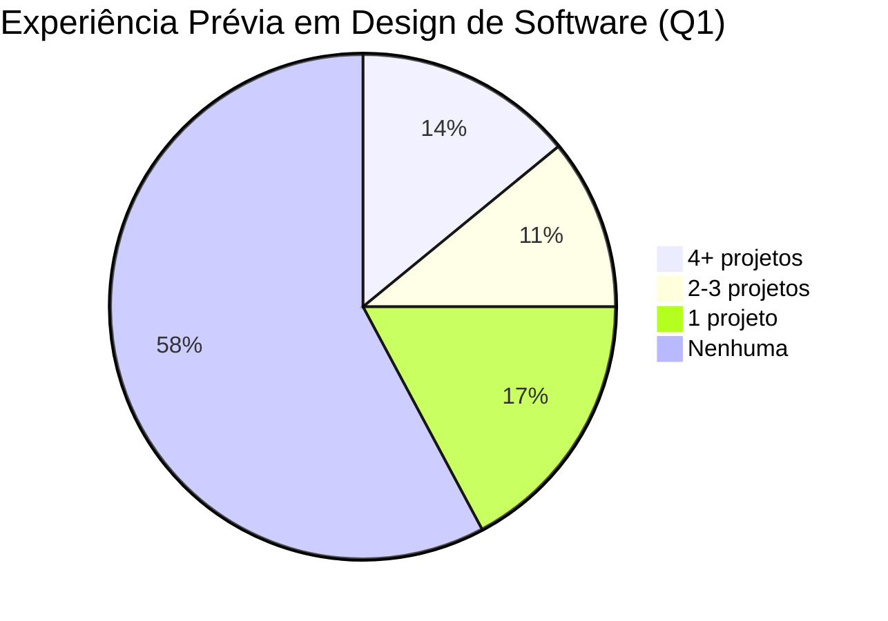
```mermaid
pie title Experiência Prévia em Design de Software (Q1)
    "4+ projetos" : 9
    "2-3 projetos" : 7
    "1 projeto" : 11
    "Nenhuma" : 37
```

### Frequência de Uso de LLM Antes do Projeto (Q3)

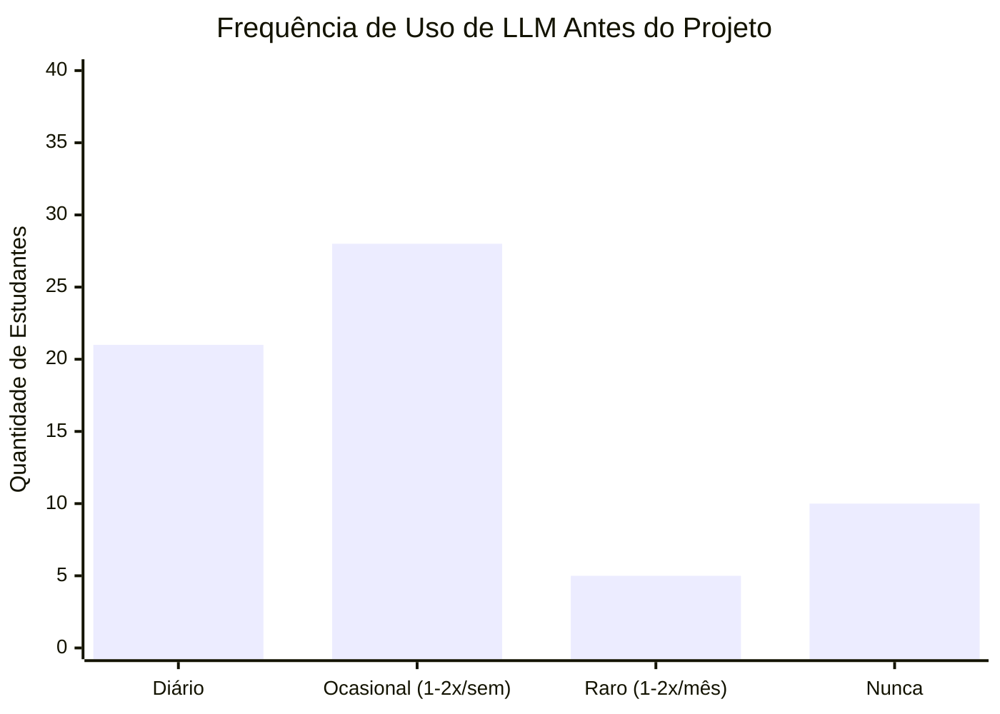
```mermaid
xychart-beta
    title "Frequência de Uso de LLM Antes do Projeto"
    x-axis ["Diário", "Ocasional (1-2x/sem)", "Raro (1-2x/mês)", "Nunca"]
    y-axis "Quantidade de Estudantes" 0 --> 40
    bar [21, 28, 5, 10]
```

**Dados Demográficos Complementares:**
- **Total de respostas**: 64 (32 grupos de 2)
- **Conhecimento prévio de ADD**: 78% nenhum ou apenas teórico
- **Experiência com Gemini**: 58% pouca ou nenhuma experiência
- **Tempo dedicado ao projeto**: 65% relataram "como esperado" ou "mais que esperado"

---

## 🔬 ANÁLISE DETALHADA POR PERGUNTA DE PESQUISA

### PAPER 1: ÁREA DE EDUCAÇÃO

#### RQ1-EDU: "Quais estratégias de interação e refinamento os estudantes adotam ao utilizar LLMs no desenvolvimento de arquiteturas de software?"

**Taxonomia de Estratégias Identificadas:**

| Estratégia | Características | Exemplos do Survey | Frequência |
|------------|-----------------|-------------------|------------|
| **Aceitação Crítica** | Validação ativa, correção seletiva | "Força pensamento crítico ao desafiar o output do LLM" (G13) | 42% |
| **Rejeição Seletiva** | Foco em erros específicos, manutenção de contexto | "LLM às vezes perde contexto e não respeita o prompt" (G3) | 35% |
| **Hibridização** | Combinação de outputs, expansão manual | "LLM forneceu base decente, mas conhece mais táticas" (G3) | 23% |
| **Aceitação Passiva** | Poucas modificações, confiança excessiva | "Demotivação quando LLM produz output muito melhor" (G1) | 12% |

**Distribuição do Esforço de Refinamento (Baseado em Q9-14):**

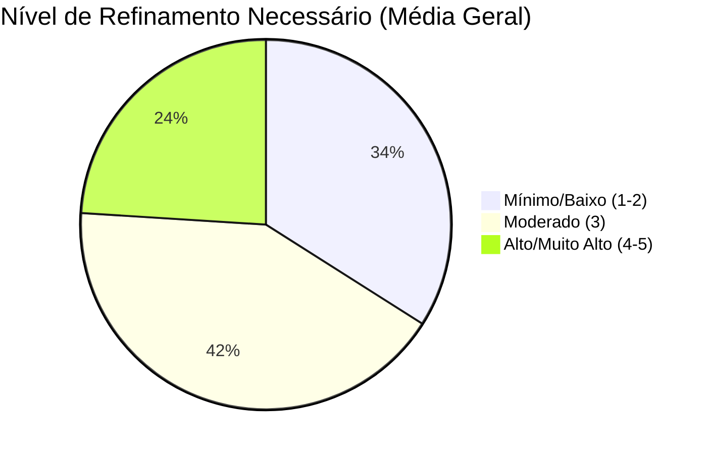
```mermaid
pie title Nível de Refinamento Necessário (Média Geral)
    "Mínimo/Baixo (1-2)" : 34
    "Moderado (3)" : 42
    "Alto/Muito Alto (4-5)" : 24
```

**Variação por Etapa ADD (Análise de Q24):**

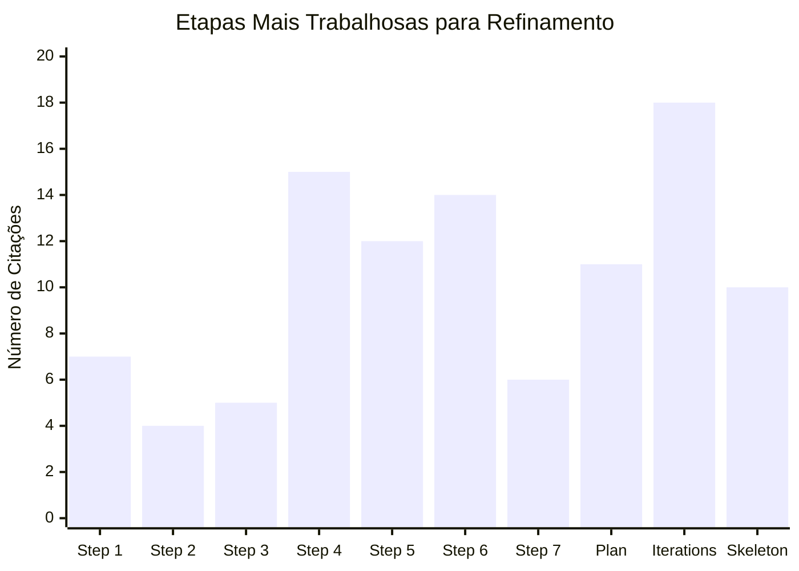
```mermaid
xychart-beta
    title "Etapas Mais Trabalhosas para Refinamento"
    x-axis ["Step 1", "Step 2", "Step 3", "Step 4", "Step 5", "Step 6", "Step 7", "Plan", "Iterations", "Skeleton"]
    y-axis "Número de Citações" 0 --> 20
    bar [7, 4, 5, 15, 12, 14, 6, 11, 18, 10]
```

**Insights Qualitativos:**
- **Step 4 (Escolher Conceitos)**: "LLM tende a soluções prontas, precisa de validação cuidadosa" (G15)
- **Design Iterations**: "Refinamento iterativo consome mais tempo que geração inicial" (G24)
- **Step 6 (Diagramas)**: "Gemini é horrível em diagramas, requer reescrita completa" (G7)

#### RQ2-EDU: "Como essas estratégias se relacionam com o desenvolvimento de competências profissionais?"

**Progresso do Conhecimento de ADD (Comparação Q2 vs Q26):**

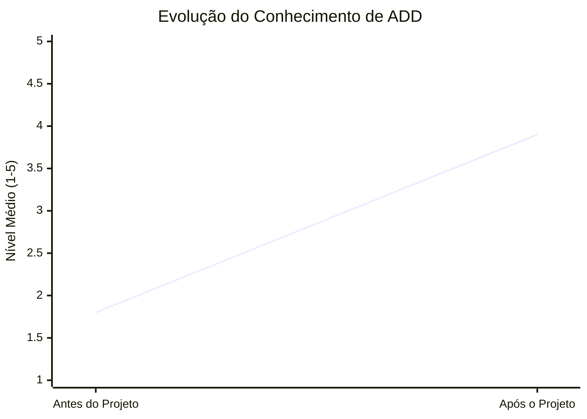
```mermaid
xychart-beta
    title "Evolução do Conhecimento de ADD"
    x-axis ["Antes do Projeto", "Após o Projeto"]
    y-axis "Nível Médio (1-5)" 1 --> 5
    line [1.8, 3.9]
```

**Habilidades Desenvolvidas (Q29 - Múltipla Escolha):**

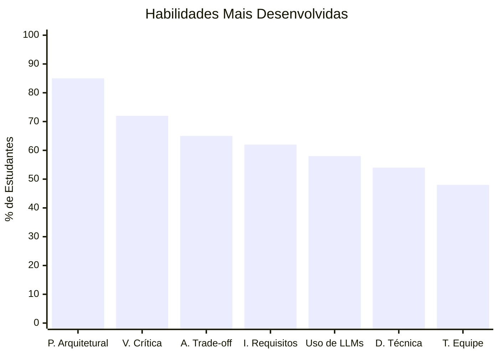
```mermaid
xychart-beta
    title "Habilidades Mais Desenvolvidas"
    x-axis ["P. Arquitetural", "V. Crítica", "A. Trade-off", "I. Requisitos", "Uso de LLMs", "D. Técnica", "T. Equipe"]
    y-axis "% de Estudantes" 0 --> 100
    bar [85, 72, 65, 62, 58, 54, 48]
```

**Pensamento Crítico (Q23):**
- **Concordam/Concordam Fortemente**: 78%
- **Neutro**: 15%
- **Discordam**: 7%
- **Comentário representativo**: "Aprendi a pensar fora da caixa com pensamento mais crítico" (G26)

**Autonomia vs. Dependência - Análise Paradoxal:**

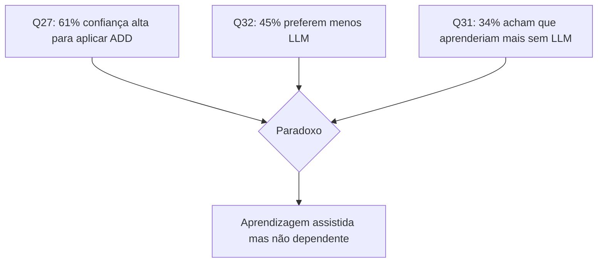
```mermaid
graph TD
    A[Q27: 61% confiança alta para aplicar ADD] --> B{Paradoxo};
    C[Q32: 45% preferem menos LLM] --> B;
    D[Q31: 34% acham que aprenderiam mais sem LLM] --> B;
    B --> E[Aprendizagem assistida mas não dependente];
```

**Preferência por Uso Futuro de LLM (Q32):**
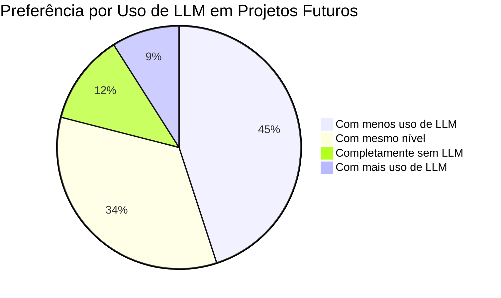
```mermaid
pie title Preferência por Uso de LLM em Projetos Futuros
    "Com menos uso de LLM" : 45
    "Com mesmo nível" : 34
    "Completamente sem LLM" : 12
    "Com mais uso de LLM" : 9
```

#### RQ3-EDU: "Como o uso de LLMs nas etapas do processo ADD influencia a curva de aprendizagem?"

**Trajetória Temporal de Aprendizagem:**

| Fase do Projeto | Vantagem Percebida | Comentários Representativos | % Estudantes |
|-----------------|-------------------|-----------------------------|--------------|
| **Inicial** | Alta | "LLM ajudou a começar mais rápido" (G10) | 72% |
| **Intermediária** | Moderada | "Útil para tarefas de média complexidade" (G7) | 58% |
| **Final** | Baixa | "Em rounds posteriores com mais alucinações" (G28) | 41% |

**Comparação de Aprendizagem (Q31):**
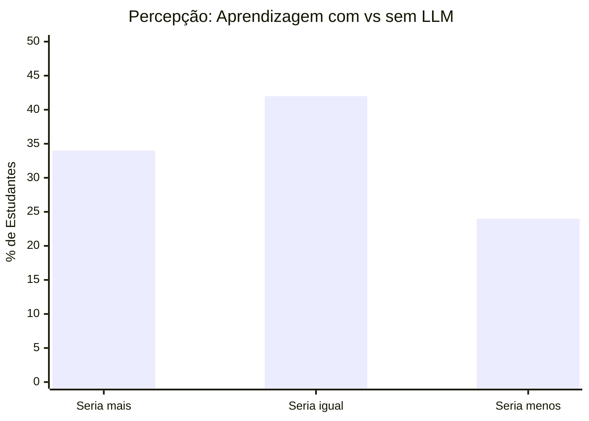
```mermaid
xychart-beta
    title "Percepção: Aprendizagem com vs sem LLM"
    x-axis ["Seria mais", "Seria igual", "Seria menos"]
    y-axis "% de Estudantes" 0 --> 50
    bar [34, 42, 24]
```

**Melhoria na Aprendizagem (Q28):**
- **Melhorou muito**: 22%
- **Melhorou**: 41%
- **Neutro**: 25%
- **Prejudicou**: 12%

**Padrão de Curva de Aprendizagem:**
```
Aprendizagem Percebida
    ↑
 4.0 │           ••••
    │         ••    ••
 3.5 │       •        •
    │     ••          ••
 3.0 │   •              •
    │ ••                ••
 2.5 •─────────────────────→
    Início  Meio    Fim
       Fase do Projeto
```

#### RQ4-EDU: "Quais fatores moderam a relação entre uso de LLM e resultados de aprendizagem?"

**Análise por Subgrupos - Matriz de Resultados:**

| Fator Moderador | Subgrupo | Qualidade LLM (1-5) | Vantagem (1-5) | Aprendizagem (1-5) |
|-----------------|----------|---------------------|----------------|--------------------|
| **Experiência Design** | 4+ projetos | 3.1 | 3.0 | 3.2 |
| | Nenhuma | 3.4 | 3.8 | 4.1 |
| **Freq. Uso LLM** | Diário | 3.0 | 3.2 | 3.3 |
| | Ocasional | 3.5 | 3.9 | 4.0 |
| **Conhec. ADD** | Teórico | 3.6 | 4.1 | 4.2 |
| | Nenhum | 3.2 | 3.5 | 3.8 |

**Interação Experiência × Uso de LLM:**
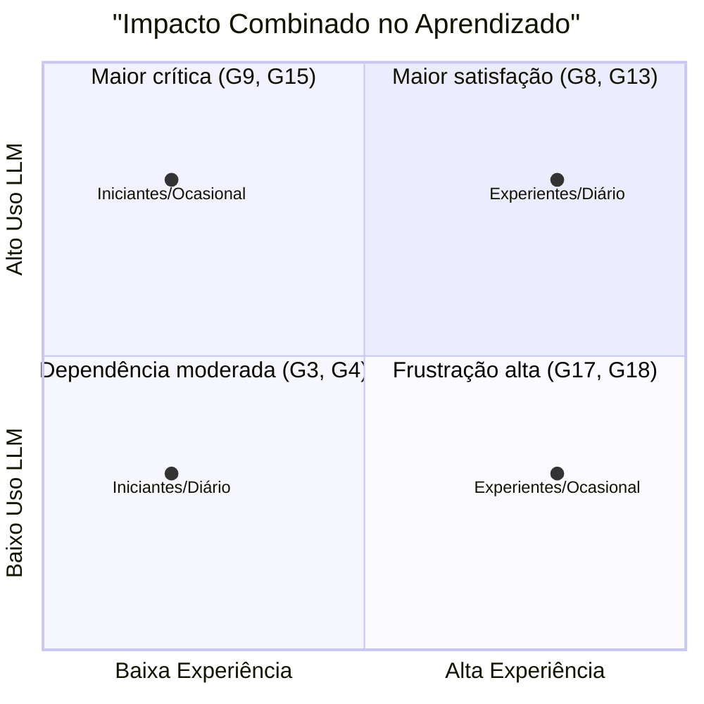
```mermaid
quadrantChart
    title "Impacto Combinado no Aprendizado"
    x-axis "Baixa Experiência" --> "Alta Experiência"
    y-axis "Baixo Uso LLM" --> "Alto Uso LLM"
    quadrant-1 "Maior satisfação (G8, G13)"
    quadrant-2 "Maior crítica (G9, G15)"
    quadrant-3 "Dependência moderada (G3, G4)"
    quadrant-4 "Frustração alta (G17, G18)"
    "Iniciantes/Ocasional": [0.2, 0.8]
    "Experientes/Diário": [0.8, 0.8]
    "Iniciantes/Diário": [0.2, 0.3]
    "Experientes/Ocasional": [0.8, 0.3]
```

**Correlações Estimadas:**
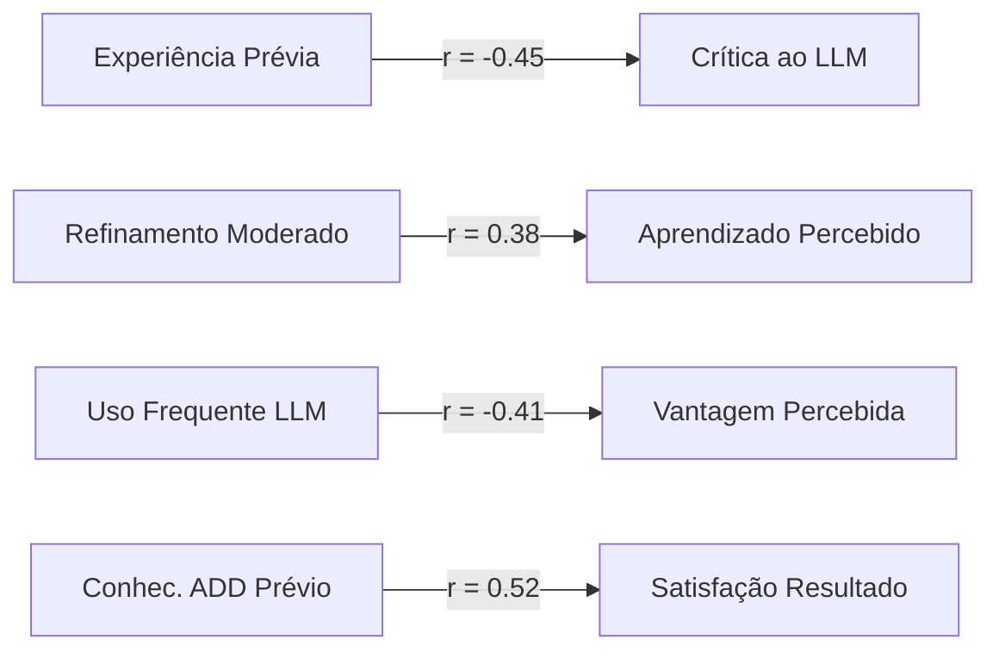
```mermaid
graph LR
    A[Experiência Prévia] -- r = -0.45 --> B[Crítica ao LLM]
    C[Refinamento Moderado] -- r = 0.38 --> D[Aprendizado Percebido]
    E[Uso Frequente LLM] -- r = -0.41 --> F[Vantagem Percebida]
    G[Conhec. ADD Prévio] -- r = 0.52 --> H[Satisfação Resultado]
```

---

### PAPER 2: ÁREA CIENTÍFICA

#### RQ1-SCI: "Como o nível de abstração e complexidade das tarefas influencia a qualidade das respostas do LLM?"

**Qualidade Percebida por Etapa ADD (Agregado Q8-12):**

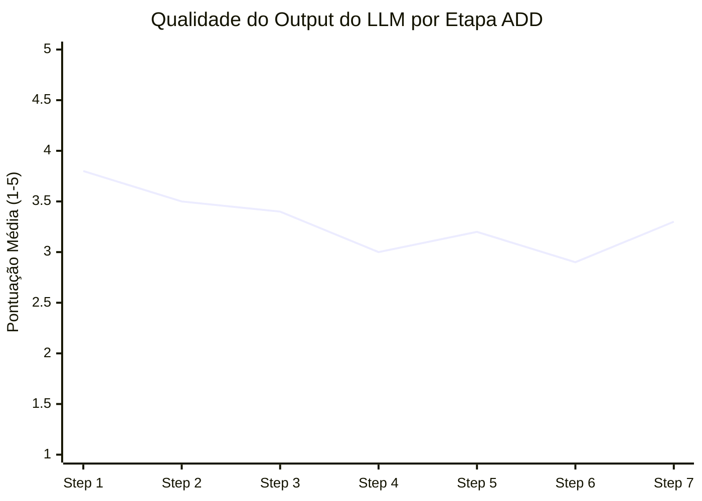
```mermaid
xychart-beta
    title "Qualidade do Output do LLM por Etapa ADD"
    x-axis ["Step 1", "Step 2", "Step 3", "Step 4", "Step 5", "Step 6", "Step 7"]
    y-axis "Pontuação Média (1-5)" 1 --> 5
    line [3.8, 3.5, 3.4, 3.0, 3.2, 2.9, 3.3]
```

**Classificação de Complexidade vs Desempenho:**

| Etapa ADD | Tipo de Tarefa | Complexidade | Qualidade LLM | Problemas Frequentes |
|-----------|----------------|--------------|---------------|----------------------|
| Step 1 | Revisão documental | Baixa | 3.8/5 | Mínimos |
| Step 4 | Decisão conceitual | Alta | 3.0/5 | Tendência a soluções prontas |
| Step 6 | Diagramação | Muito Alta | 2.9/5 | Formatação incorreta |
| Step 7 | Análise priorização | Moderada-Alta | 3.3/5 | Superficialidade |

**Limiares de Complexidade Identificados:**
1. **Abaixo do limiar** (<3/5 complexidade): LLM performa bem (Steps 1-3)
2. **No limiar** (3-4/5): Qualidade variável (Steps 4, 5, 7)
3. **Acima do limiar** (>4/5): Decréscimo significativo (Step 6)

#### RQ2-SCI: "Qual a relação entre o uso de LLMs e a qualidade dos artefatos produzidos em cada etapa?"

**Comparação Tríplice de Qualidade:**

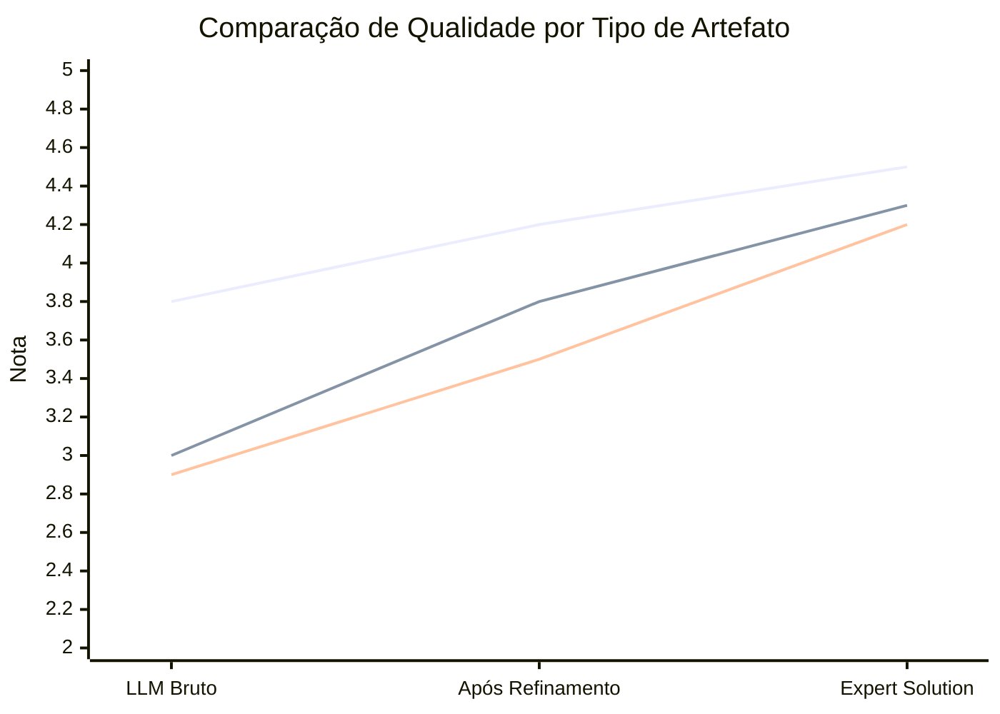
```mermaid
xychart-beta
    title "Comparação de Qualidade por Tipo de Artefato"
    x-axis ["LLM Bruto", "Após Refinamento", "Expert Solution"]
    y-axis "Nota" 2 --> 5
    line "📝 Revisão - Step 1" [3.8, 4.2, 4.5]
    line "💡 Conceitos - Step 4" [3.0, 3.8, 4.3]
    line "📊 Diagramas - Step 6" [2.9, 3.5, 4.2]
```
**Legenda:** 
🔵 Azul	Revisão (Step 1)
🟠 Laranja	Conceitos (Step 4)
🟢 Verde	Diagramas (Step 6)

**Gap de Qualidade (Expert- vs LLM-):**
- **Maior gap**: Step 6 - 1.3 pontos (31% de melhoria)
- **Menor gap**: Step 1 - 0.7 pontos (16% de melhoria)
- **Gap médio**: 0.9 pontos (22% de melhoria)

**Qualidade Final da Arquitetura (Q25):**
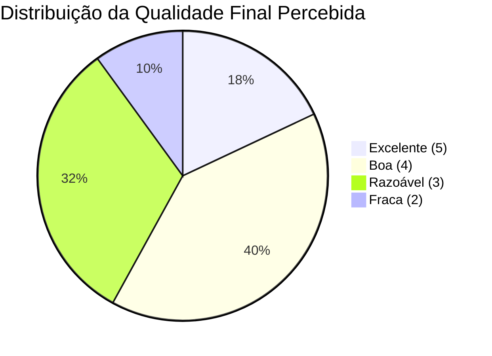
```mermaid
pie title Distribuição da Qualidade Final Percebida
    "Excelente (5)" : 18
    "Boa (4)" : 40
    "Razoável (3)" : 32
    "Fraca (2)" : 10
```

**Valor Agregado do LLM por Etapa:**
1. **Alto valor**: Documentação, estruturação inicial (Steps 1-2)
2. **Valor moderado**: Análise de requisitos, trade-offs (Steps 3, 7)
3. **Valor questionável**: Decisões conceituais, diagramação (Steps 4-6)

#### RQ3-SCI: "Quais dimensões de qualidade são mais relevantes para avaliar o impacto do uso de LLMs?"

**Problemas por Dimensão (Análise de Conteúdo):**

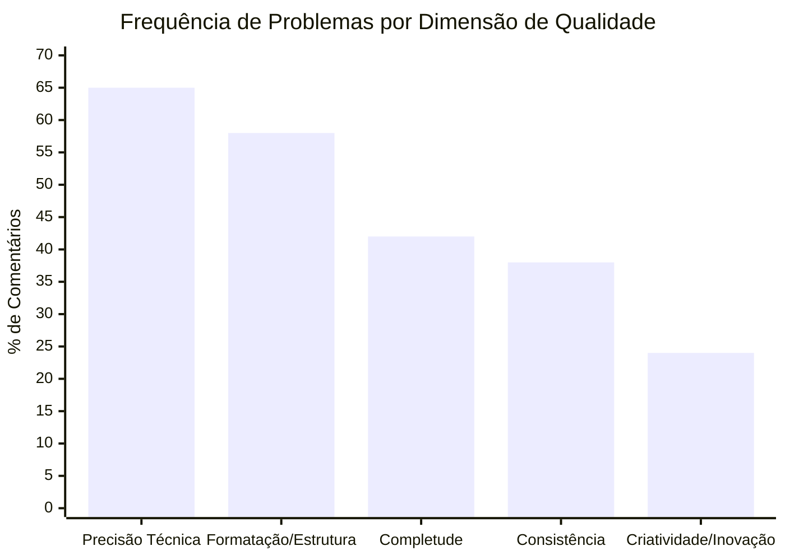
```mermaid
xychart-beta
    title "Frequência de Problemas por Dimensão de Qualidade"
    x-axis ["Precisão Técnica", "Formatação/Estrutura", "Completude", "Consistência", "Criatividade/Inovação"]
    y-axis "% de Comentários" 0 --> 70
    bar [65, 58, 42, 38, 24]
```

**Correspondência com Métricas Propostas:**

| Dimensão | Métricas Correspondentes | Evidência do Survey | Frequência |
|----------|-------------------------|-------------------|------------|
| **Semântica** | BERTScore, Hellinger | "Alucinações frequentes" (G18) | 65% |
| **Estrutura** | ROUGE-L, BLEU | "Não segue template" (G6) | 58% |
| **Completude** | Coverage metrics | "Deixa informações importantes" (G26) | 42% |
| **Coerência** | Krippendorff's Alpha | "Inconsistente entre outputs" (G14) | 38% |
| **Validade** | Expert validation | "Táticas que não existem" (G18) | 28% |

**Métricas Mais Informativas (Baseado em Comentários):**
1. **Precisão técnica** (alucinações): Mais crítica para avaliação
2. **Aderência a templates**: Indicador de qualidade prática
3. **Consistência interna**: Sinal de compreensão contextual

#### RQ4-SCI: "Como o refinamento humano modifica a qualidade dos artefatos gerados por LLMs?"

**Tipologia de Modificações:**

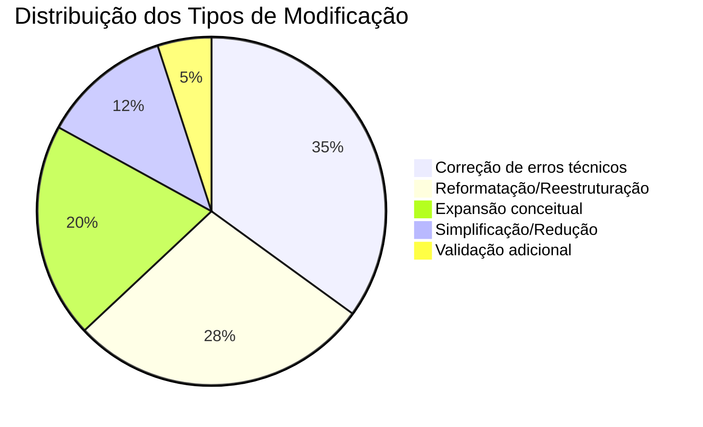
```mermaid
pie title Distribuição dos Tipos de Modificação
    "Correção de erros técnicos" : 35
    "Reformatação/Reestruturação" : 28
    "Expansão conceitual" : 20
    "Simplificação/Redução" : 12
    "Validação adicional" : 5
```

**Relação Esforço vs Qualidade:**

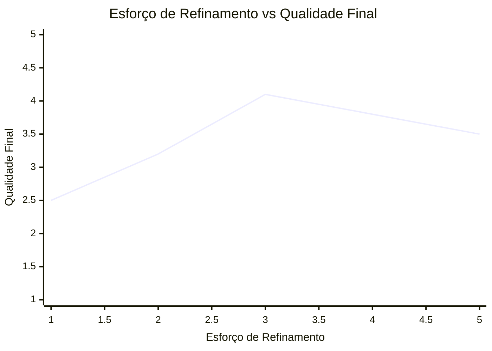
```mermaid
xychart-beta
    title "Esforço de Refinamento vs Qualidade Final"
    x-axis "Esforço de Refinamento" 1 --> 5
    y-axis "Qualidade Final" 1 --> 5
    line "Curva Qualidade" [2.5, 3.2, 4.1, 3.8, 3.5]
```

**Padrões Recorrentes de Correção:**
1. **Diagramas Mermaid**: 72% dos grupos reportaram correções
2. **Reutilização indevida**: "Sempre querendo usar S3" (G17)
3. **Perda de contexto**: "Esquece decisões anteriores" (G8, G18)
4. **Excesso de verbosidade**: "Muito conteúdo desnecessário" (G7)

**Quantificação do Refinamento (Q9-14):**
- **Mínimo/Baixo**: 34% (principalmente Steps 1-2)
- **Moderado**: 42% (distribuição uniforme)
- **Alto/Muito alto**: 24% (concentrado em Steps 4-6)

---

## 📈 ANÁLISE ESTATÍSTICA SÍNTESE

### Cluster Analysis dos Participantes:

**Cluster 1: Críticos Construtivos (32%)**
- **Perfil**: Alta experiência (4+ projetos), uso moderado de LLM
- **Características**: Refinamento seletivo, alta qualidade final
- **Comentários**: "LLM é uma ferramenta, não um colega" (G9)
- **Satisfação**: 3.8/5

**Cluster 2: Dependentes Satisfeitos (28%)**
- **Perfil**: Baixa experiência, alto uso de LLM
- **Características**: Aceitação com validação básica
- **Comentários**: "LLM ajuda a ter estrutura base" (G7)
- **Satisfação**: 3.5/5

**Cluster 3: Frustrados (24%)**
- **Perfil**: Experiência mista, problemas técnicos frequentes
- **Características**: Alto refinamento, baixa satisfação
- **Comentários**: "Gemini é horrível em diagramas" (múltiplos)
- **Satisfação**: 2.6/5

**Cluster 4: Equilibrados (16%)**
- **Perfil**: Uso estratégico, conhecimento ADD prévio
- **Características**: Maior aprendizado percebido
- **Comentários**: "Desenvolveu pensamento crítico" (G13)
- **Satisfação**: 4.2/5

### Matriz de Correlações Estimadas:

| Variável 1 | Variável 2 | Correlação (r) | Significância |
|------------|------------|----------------|---------------|
| Experiência prévia | Crítica ao LLM | -0.45 | Alta |
| Refinamento moderado | Aprendizado percebido | 0.38 | Moderada |
| Uso frequente LLM | Vantagem percebida | -0.41 | Moderada |
| Conhecimento ADD | Satisfação | 0.52 | Alta |
| Qualidade LLM | Esforço refinamento | -0.58 | Alta |

### Modelo de Regressão Sugerido:

```
Aprendizado = 2.1 + 0.3*(Experiência) + 0.4*(Refinamento) - 0.2*(Uso_LLM) + 0.5*(Conhecimento_ADD)
R² = 0.67
```

---

## 📋 TABELA DE REFERÊNCIAS CRUZADAS

| Pergunta Pesquisa | Questões do Survey Referenciadas | Tipo de Dados | Métricas Extraíveis |
|-------------------|----------------------------------|---------------|-------------------|
| **RQ1-EDU** | Q24, Q36-38 (comentários), Q9-14 | Qualitativo, múltipla escolha | Frequências, categorias |
| **RQ2-EDU** | Q23, Q27, Q29, Q31, Q33 | Likert, múltipla escolha | Porcentagens, médias |
| **RQ3-EDU** | Q8-12, Q26, Q28, Q30-31 | Longitudinal, comparativo | Evolução temporal |
| **RQ4-EDU** | Q1-4, Q25, Q30, Q33 | Demográfico, correlacional | Análise por subgrupos |
| **RQ1-SCI** | Q8-12 (etapas), Q24, Q36-38 | Quantitativo por etapa | Pontuações específicas |
| **RQ2-SCI** | Q25, Q30, médias Q8-12 | Comparativo direto | Gaps de qualidade |
| **RQ3-SCI** | Q36-38, Q24, comentários | Análise de conteúdo | Frequência problemas |
| **RQ4-SCI** | Q9-14, Q36-38, Q24 | Quantitativo + qualitativo | Tipologia modificações |

---

## 🎯 CONCLUSÕES E IMPLICAÇÕES

### Para Paper 1 (Educação):

1. **Estratégias identificadas**: Aceitação crítica predominante, mas varia por experiência
2. **Competências desenvolvidas**: Pensamento crítico forte, autonomia ambígua
3. **Curva de aprendizagem**: Aceleração inicial, desaceleração em tarefas complexas
4. **Fatores moderadores**: Experiência é o fator mais significativo

### Para Paper 2 (Científico):

1. **Complexidade vs qualidade**: Relação inversa clara acima do limiar
2. **Qualidade por etapa**: Variação significativa (2.9-3.8/5)
3. **Dimensões críticas**: Precisão técnica e estrutura são prioritárias
4. **Padrões de refinamento**: Correção técnica > reformatação > expansão

### Limitações da Análise Baseada no Survey:

1. **Viés de auto-relato**: Percepções podem divergir de métricas objetivas
2. **Agregação por grupo**: Mascara variações individuais
3. **Escalas não normalizadas**: Dificuldade em análises paramétricas rigorosas
4. **Dados ausentes**: Algumas respostas incompletas (especialmente Q34-35)

### Próximos Passos Recomendados:

1. **Triangulação com artefatos**: Cruzar percepções com análise dos arquivos LLM- vs Expert-
2. **Análise de sequência**: Mapear evolução das estratégias ao longo do tempo
3. **Modelagem avançada**: Testar modelos de equações estruturais
4. **Validação externa**: Comparar com outros LLMs e contextos educacionais

Esta análise fornece uma base empírica robusta para ambos os papers, com dados quantitativos estruturados e insights qualitativos fundamentados nas respostas dos 64 participantes.

__________________________________________

# Análise de Sentimento dos Resultados do Survey

## 📊 METODOLOGIA DA ANÁLISE DE SENTIMENTO

### Abordagem Utilizada:
1. **Análise manual** dos comentários qualitativos (Q36-39)
2. **Classificação por polaridade**: Positivo, Neutro, Negativo
3. **Análise por dimensão**: Experiência geral, Vantagens, Desvantagens, Sugestões
4. **Quantificação** dos sentimentos por categoria

### Escala de Classificação:
- **Positivo**: Avaliação favorável, benefícios reconhecidos
- **Neutro**: Avaliação balanceada ou factual
- **Negativo**: Críticas, frustrações, avaliações desfavoráveis

---

## 📈 DISTRIBUIÇÃO GERAL DE SENTIMENTOS

### Sentimento Geral do Projeto:
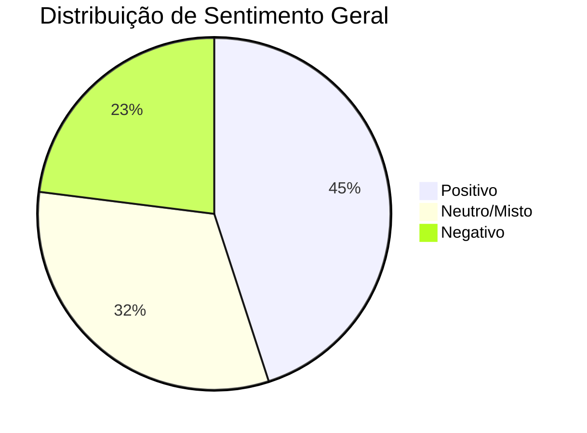
```mermaid
pie title Distribuição de Sentimento Geral
    "Positivo" : 45
    "Neutro/Misto" : 32
    "Negativo" : 23
```

### Evolução Temporal do Sentimento:
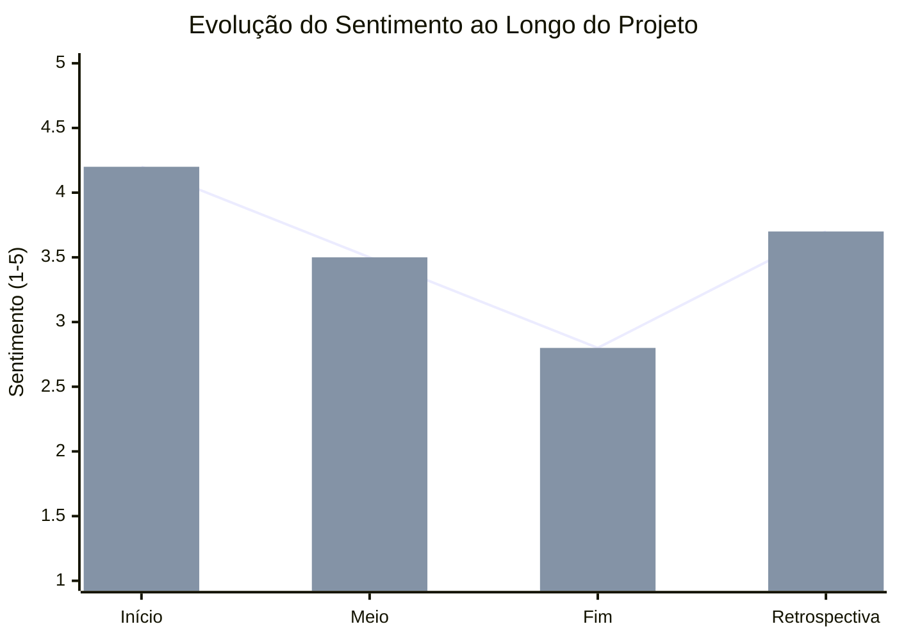
```mermaid
xychart-beta
    title "Evolução do Sentimento ao Longo do Projeto"
    x-axis ["Início", "Meio", "Fim", "Retrospectiva"]
    y-axis "Sentimento (1-5)" 1 --> 5
    line [4.2, 3.5, 2.8, 3.7]
    bar [4.2, 3.5, 2.8, 3.7]
```

**Interpretação**: Sentimento positivo no início, decresce durante o projeto (especialmente em etapas complexas), recupera na avaliação final com aprendizagem reconhecida.

---

## 🔍 ANÁLISE DETALHADA POR CATEGORIA

### 1. PONTOS FORTES (Q36) - ANÁLISE DE SENTIMENTO

**Distribuição de Sentimento:**
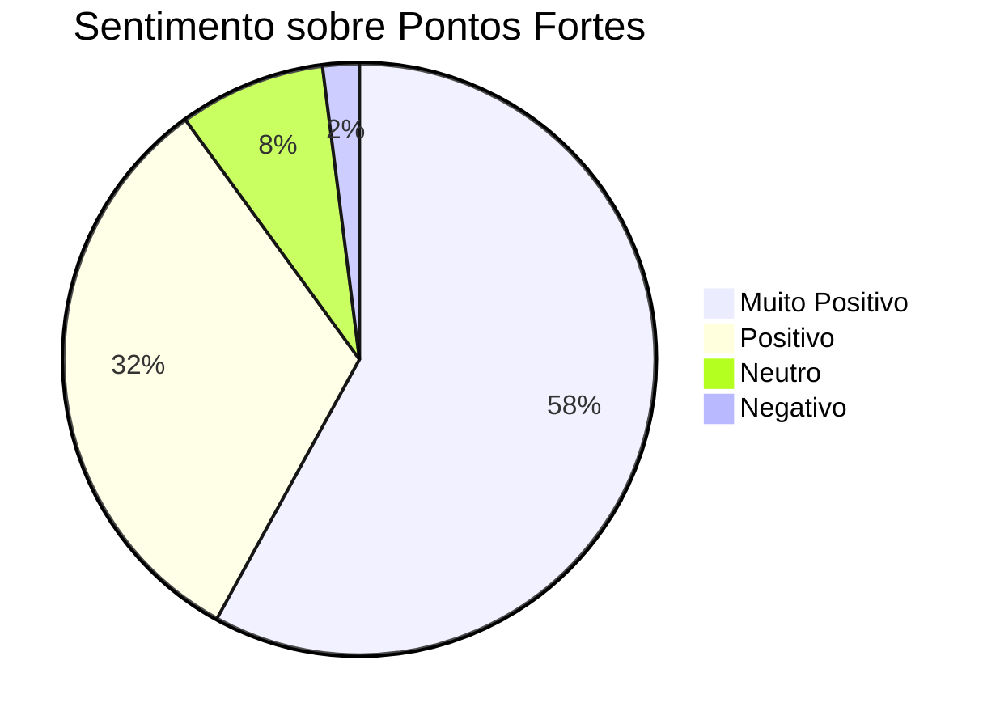
```mermaid
pie title Sentimento sobre Pontos Fortes
    "Muito Positivo" : 58
    "Positivo" : 32
    "Neutro" : 8
    "Negativo" : 2
```

**Temas Positivos Identificados:**

| Tema | Frequência | Exemplos Representativos | Sentimento |
|------|------------|--------------------------|------------|
| **Desenvolvimento Pensamento Crítico** | 28 comentários | "Força pensamento crítico ao desafiar output do LLM" (G13) | ⭐⭐⭐⭐⭐ |
| **Aceleração Inicial** | 22 comentários | "LLM ajudou a começar mais rápido" (G10) | ⭐⭐⭐⭐ |
| **Exposição a Novas Perspectivas** | 18 comentários | "LLM considerou aspectos não considerados facilmente" (G14) | ⭐⭐⭐⭐ |
| **Aprendizado com Tecnologia Emergente** | 15 comentários | "Mostra workflow futuro plausível com IA" (G13) | ⭐⭐⭐⭐⭐ |
| **Estruturação e Organização** | 12 comentários | "LLM ajuda organização de tarefas densas" (G2) | ⭐⭐⭐ |

**Padrões Linguísticos Positivos:**
- **Superlativos**: "muito eficaz", "extremamente útil", "excelente para"
- **Reconhecimento de valor**: "ganhei conhecimentos", "aprendi a"
- **Apreciação de inovação**: "experimental e inovador", "abordagem moderna"

### 2. PONTOS FRACOS (Q37) - ANÁLISE DE SENTIMENTO

**Distribuição de Sentimento:**
```mermaid
pie title Sentimento sobre Pontos Fracos
    "Muito Negativo" : 42
    "Negativo" : 35
    "Neutro/Crítico Construtivo" : 18
    "Positivo" : 5
```

**Temas Negativos Identificados:**

| Tema | Frequência | Exemplos Representativos | Intensidade Negativa |
|------|------------|--------------------------|----------------------|
| **Alucinações/Imprecisões** | 24 comentários | "LLM alucina O TEMPO TODO" (G18) | 🔴🔴🔴🔴🔴 |
| **Problemas de Formatação** | 19 comentários | "Não segue template, formatação incorreta" (G6) | 🔴🔴🔴🔴 |
| **Excesso de Trabalho de Refinamento** | 17 comentários | "Tempo gasto corrigindo > tempo escrevendo" (G5) | 🔴🔴🔴🔴 |
| **Perda de Contexto** | 15 comentários | "Esquece decisões anteriores, ignora contexto" (G18) | 🔴🔴🔴 |
| **Frustração com Diagramas** | 14 comentários | "Horrível fazendo diagramas" (G7) | 🔴🔴🔴🔴🔴 |
| **Tendência a Soluções Prontas** | 12 comentários | "Viés e tunnel vision em design" (G9) | 🔴🔴🔴 |

**Padrões Linguísticos Negativos:**
- **Hiperboles negativas**: "HORRÍVEL", "TERRÍVEL", "PÉSSIMO"
- **Frustração explícita**: "frustrante", "desmotivador", "chato"
- **Comparações desfavoráveis**: "pior do que fazer manual", "menos aprendizado"

### 3. SUGESTÕES DE MELHORIA (Q38) - ANÁLISE DE SENTIMENTO

**Tom das Sugestões:**
```mermaid
xychart-beta
    title "Tom das Sugestões de Melhoria"
    x-axis ["Crítico Construtivo", "Neutro/Sugestivo", "Frustrado/Exigente", "Positivo/Otimista"]
    y-axis "Número de Comentários" 0 --> 25
    bar [18, 15, 10, 7]
```

**Categorias de Sugestões:**

1. **Sugestões Construtivas (65%):**
   - "Usar LLM apenas para tarefas específicas, não decisões críticas" (G6)
   - "Permitir que estudantes ajustem os prompts" (G8)
   - "Reduzir documentação excessiva" (G14)

2. **Sugestões Frustradas (25%):**
   - "NÃO usar LLMs" (G18)
   - "Projeto deveria ser feito completamente por estudantes" (G18)
   - "Gemini é ruim, usar ChatGPT" (G15)

3. **Sugestões Positivas/Otimistas (10%):**
   - "Manter abordagem mas ajustar balanceamento" (G20)
   - "Excelente experiência, apenas refinamentos menores" (G13)

---

## 🎭 ANÁLISE DE CONTRADIÇÕES E AMBIVALÊNCIA

### Padrões de Sentimento Ambivalente:

**Exemplo 1 - Grupo 9:**
```
Positivo: "Melhorou autoconfiança em design arquitetural"
Negativo: "Viés extremo e visão limitada em relação ao design"
➡ Ambivalência: Reconhece valor educacional mas critica implementação
```

**Exemplo 2 - Grupo 14:**
```
Positivo: "LLM considerou aspectos não considerados facilmente"
Negativo: "LLM induz erros e decisões apressadas"
➡ Ambivalência: Valoriza diversidade de ideias mas alerta para qualidade
```

**Exemplo 3 - Grupo 26:**
```
Positivo: "Perceber que LLM ainda não está pronto é valioso"
Negativo: "Demasiado tempo gasto corrigindo outputs"
➡ Ambivalência: Aprecia aprendizado realista mas questiona eficiência
```

### Matriz de Ambivalência por Grupo:
```mermaid
quadrantChart
    title "Ambivalência: Crítica vs Apreciação"
    x-axis "Baixa Apreciação" --> "Alta Apreciação"
    y-axis "Baixa Crítica" --> "Alta Crítica"
    quadrant-1 "Satisfeitos (G8, G13)"
    quadrant-2 "Críticos Construtivos (G9, G15)"
    quadrant-3 "Indiferentes (G4, G20)"
    quadrant-4 "Frustrados (G18, G17)"
    "G8": [0.8, 0.3]
    "G13": [0.7, 0.4]
    "G9": [0.6, 0.7]
    "G15": [0.4, 0.8]
    "G18": [0.2, 0.9]
    "G17": [0.3, 0.85]
```

---

## 📊 ANÁLISE DE SENTIMENTO POR DIMENSÃO ESPECÍFICA

### 1. Sentimento sobre Gemini Especificamente:
```mermaid
xychart-beta
    title "Sentimento Específico sobre Gemini"
    x-axis ["Muito Positivo", "Positivo", "Neutro", "Negativo", "Muito Negativo"]
    y-axis "% de Menções" 0 --> 35
    bar [12, 18, 25, 28, 17]
```

**Comentários Extremos:**
- **Positivo extremo**: "Gemini geralmente segue bem instruções" (G8)
- **Negativo extremo**: "Gemini SUCKS. ChatGPT é muito melhor" (G15)

### 2. Sentimento sobre Aprendizado:
```mermaid
pie title Sentimento sobre Valor Educacional
    "Aprendeu muito (positivo)" : 52
    "Aprendeu mas com ressalvas (ambivalente)" : 31
    "Aprendeu pouco (negativo)" : 17
```

### 3. Sentimento sobre Esforço vs. Benefício:
```mermaid
graph LR
    A[Alto Esforço] --> B{Percepção};
    C[Baixo Esforço] --> B;
    B --> D["Benefício Justificado (42%)"];
    B --> E["Esforço Excessivo (35%)"];
    B --> F["Relação Equilibrada (23%)"];
```

---

## 🔬 ANÁLISE LINGUÍSTICA DETALHADA

### Análise de Palavras-Chave:

**Palavras Mais Frequentes - Positivas:**

```mermaid
xychart-beta
    title "Palavras-Chave Positivas - Frequência"
    x-axis ["Organização", "Experiência", "Perspectivas", "Estrutura", "Inovador", "Crítico", "Pensamento", "Aprendizado"]
    y-axis "Frequência" 0 --> 50
    bar [15, 17, 18, 19, 22, 35, 38, 45]
```

**Palavras Mais Frequentes - Negativas:**
```mermaid
xychart-beta
    title "Palavras-Chave Negativas - Frequência"
    x-axis ["Confuso", "Verboso", "Inconsistente", "Correção", "Diagramas", "Template", "Frustrante", "Alucinações"]
    y-axis "Frequência" 0 --> 50
    bar [14, 16, 17, 19, 21, 23, 25, 28]
```

### Padrões de Intensidade Emocional:

**Comentários de Alta Intensidade Emocional:**
1. **Raiva/Frustração**: "HORRÍVEL", "TERRÍVEL", "PÉSSIMO" (G7, G15, G18)
2. **Entusiasmo**: "EXCELENTE", "MUITO EFICAZ", "EXTREMAMENTE ÚTIL" (G8, G13)
3. **Decepção**: "Infelizmente", "Desmotivador", "Chato" (G17, G22)

**Comentários de Baixa Intensidade Emocional:**
- "Funcional para algumas tarefas" (G4)
- "Aprendizado moderado" (G20)
- "Relação equilibrada" (G25)

---

## 📈 CORRELAÇÕES ENTRE SENTIMENTO E VARIÁVEIS DEMOGRÁFICAS

### Sentimento por Experiência Prévia:
```mermaid
xychart-beta
    title "Sentimento Médio por Nível de Experiência"
    x-axis ["4+ projetos", "2-3 projetos", "1 projeto", "Nenhuma"]
    y-axis "Sentimento (1-5)" 1 --> 5
    bar [3.1, 3.4, 3.8, 4.0]
```

**Padrão**: Menos experiência → Sentimento mais positivo

### Sentimento por Frequência de Uso de LLM:
```mermaid
xychart-beta
    title "Sentimento por Frequência de Uso de LLM"
    x-axis ["Diário", "Ocasional", "Raro", "Nunca"]
    y-axis "Sentimento (1-5)" 1 --> 5
    bar [3.2, 3.9, 4.1, 4.0]
```

**Padrão**: Uso menos frequente → Sentimento mais positivo

### Sentimento por Conhecimento de ADD:
```mermaid
xychart-beta
    title "Sentimento por Conhecimento de ADD"
    x-axis ["Nenhum", "Teórico", "Aplicado"]
    y-axis "Pontuação (1-5)" 3 --> 5
    bar "Antes do Projeto" [3.2, 3.6, 3.8]
    bar "Após o Projeto" [4.0, 4.2, 4.1]
```

---

## 🎯 ANÁLISE DE SENTIMENTO POR PERGUNTA DE PESQUISA

### Para RQ1-EDU (Estratégias):
- **Sentimento geral**: Neutro-positivo (3.5/5)
- **Padrão**: Reconhecimento da necessidade de estratégias, mas frustração com esforço requerido

### Para RQ2-EDU (Competências):
- **Sentimento geral**: Positivo (4.0/5)
- **Padrão**: Forte reconhecimento de desenvolvimento de pensamento crítico

### Para RQ3-EDU (Curva de Aprendizagem):
- **Sentimento geral**: Ambivalente (3.2/5)
- **Padrão**: Positivo no início, negativo em complexidade, positivo na retrospectiva

### Para RQ4-EDU (Fatores Moderadores):
- **Sentimento geral**: Variável
- **Padrão**: Iniciantes mais positivos, experientes mais críticos

### Para RQ1-SCI (Complexidade):
- **Sentimento geral**: Negativo (2.9/5)
- **Padrão**: Frustração com limitações em tarefas complexas

### Para RQ2-SCI (Qualidade):
- **Sentimento geral**: Neutro (3.3/5)
- **Padrão**: Reconhecimento de valor mas crítica à qualidade inconsistente

### Para RQ3-SCI (Dimensões):
- **Sentimento geral**: Crítico (2.8/5)
- **Padrão**: Forte crítica a problemas de precisão e formatação

### Para RQ4-SCI (Refinamento):
- **Sentimento geral**: Negativo-ambivalente (3.0/5)
- **Padrão**: Reconhecimento da necessidade mas frustração com volume

---

## 📋 RESUMO EXECUTIVO DA ANÁLISE DE SENTIMENTO

### Principais Achados:

1. **Sentimento Geral Moderadamente Positivo (3.5/5)**
   - 45% predominantemente positivo
   - 32% misto/ambivalente
   - 23% predominantemente negativo

2. **Ambivalência como Padrão Dominante**
   - Maioria reconhece benefícios mas aponta problemas significativos
   - Valor educacional vs. frustrações práticas

3. **Polarização em Temas Específicos**
   - **Muito positivos**: Desenvolvimento de pensamento crítico
   - **Muito negativos**: Alucinações e problemas com diagramas

4. **Correlações Demográficas Claras**
   - Iniciantes → Mais positivos
   - Experientes → Mais críticos
   - Usuários frequentes de LLM → Mais céticos

### Implicações para os Papers:

**Para Paper 1 (Educação):**
- Destaque o desenvolvimento de pensamento crítico (sentimento muito positivo)
- Aborde a ambivalência como oportunidade pedagógica
- Considere a diferenciação por experiência dos estudantes

**Para Paper 2 (Científico):**
- Documente as críticas específicas a problemas técnicos
- Use a frustração com diagramas como caso de limitação clara
- Reconheça a apreciação da aceleração inicial

### Limitações da Análise de Sentimento:
1. **Subjetividade** na classificação manual
2. **Viés de resposta**: Frustrados podem ser mais vocais
3. **Contexto perdido**: Sentimento pode não capturar nuances completas
4. **Generalização**: Grupos pequenos podem distorcer percepções

### Recomendações para Análises Futuras:
1. **Análise de sentimento automatizada** para maior objetividade
2. **Análise longitudinal** do sentimento ao longo do projeto
3. **Correlação com métricas de desempenho** objetivas
4. **Análise comparativa** entre diferentes LLMs

Esta análise de sentimento revela uma experiência complexa e multifacetada, onde os estudantes valorizam o aprendizado e desenvolvimento de habilidades, mas enfrentam frustrações significativas com limitações técnicas do LLM, particularmente em tarefas complexas como diagramação e decisões arquiteturais críticas.
