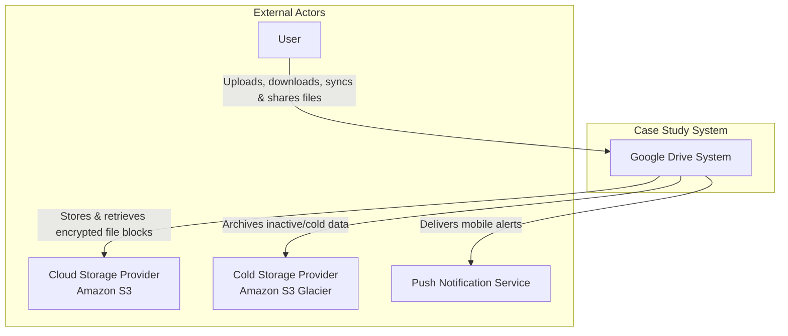

# LLMSystemContext.md

## System Context

### External Actors

| Actor | Description |
| :---  | :---        |
| ** User ** | The primary user of the system who accesses Google Drive via web browsers or mobile applications to upload, download, synchronize, and share files. They initiate file operations and resolve sync conflicts. |
| ** Cloud Storage Provider (Amazon S3) ** | An external object storage service used to store active file blocks securely. It provides high availability, scalability, and same-region or cross-region replication for data durability. |
| ** Cold Storage Provider (Amazon S3 Glacier) ** | An external storage service optimized for data archiving. The system moves infrequently used data (cold data) here to reduce storage costs while maintaining data retention. |
| ** Push Notification Service ** | An external infrastructure service (e.g., APNS, FCM) used to deliver real-time notifications to user mobile devices when files are added, edited, or shared, utilizing the Push_id stored in the database. |