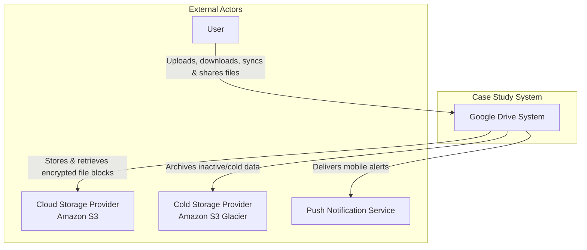

# LLMArchitecture-0.md

# Google Drive System - Architecture Document

## Table of Contents

1. [Introduction](#1-introduction)
2. [Context Diagram](#2-context-diagram)
3. [Architectural Drivers](#3-architectural-drivers)
   - [User Story Priorities](#user-story-priorities)
   - [Quality Attribute Scenario Priorities](#quality-attribute-scenario-priorities)
   - [Architectural Constraints](#architectural-constraints)
4. [Views of the module viewtype](#4-views-of-the-module-viewtype)
5. [Views of the component-and-connector viewtype](#5-views-of-the-component-and-connector-viewtype)
6. [Views of the allocation viewtype](#6-views-of-the-allocation-viewtype)
7. [Sequence Diagrams](#7-sequence-diagrams)
8. [Interfaces](#8-interfaces)
9. [Design Decisions](#9-design-decisions)

## 1. Introduction

This document provides a comprehensive architectural overview of the Google Drive-like file storage and synchronization system. It details the design decisions, architectural patterns, and structural views (Module, Component-and-Connector, and Allocation) required to satisfy the functional requirements and quality attributes. The system is designed to handle large-scale file operations, real-time synchronization across devices, and secure data storage for 10 million Daily Active Users.

## 2. Context Diagram

The following diagram illustrates the system boundaries and its interactions with external entities. It highlights the "Google Drive System" as the central black box, interacting with Users, Cloud Storage Providers (S3, Glacier), and Notification Services to fulfill its responsibilities.

### Diagram

	
### External Actors	

| Actor | Description |
| --- | --- |
| User | The primary user of the system who accesses Google Drive via web browsers or mobile applications to upload, download, synchronize, and share files. They initiate file operations and resolve sync conflicts. |
| Cloud Storage Provider (Amazon S3) | An external object storage service used to store active file blocks securely. It provides high availability, scalability, and same-region or cross-region replication for data durability. |
| Cold Storage Provider (Amazon S3 Glacier) | An external storage service optimized for data archiving. The system moves infrequently used data (cold data) here to reduce storage costs while maintaining data retention. |
| Push Notification Service | An external infrastructure service (e.g., APNS, FCM) used to deliver real-time notifications to user mobile devices when files are added, edited, or shared. |
