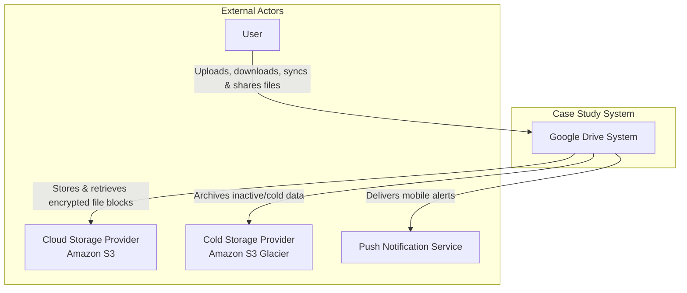

# LLMArchitecture-0.md

# Google Drive System - Architecture Document

## Table of Contents

1. [Introduction](#1-introduction)
2. [Context Diagram](#2-context-diagram)
3. [Architectural Drivers](#3-architectural-drivers)
 - [User Story Priorities](#user-story-priorities)
 - [Quality Attribute Scenario Priorities](#quality-attribute-scenario-priorities)
 - [Architectural Constraints](#architectural-constraints)
4. [Views of the module viewtype](#4-views-of-the-module-viewtype)
5. [Views of the component-and-connector viewtype](#5-views-of-the-component-and-connector-viewtype)
6. [Views of the allocation viewtype](#6-views-of-the-allocation-viewtype)
7. [Sequence Diagrams](#7-sequence-diagrams)
8. [Interfaces](#8-interfaces)
9. [Design Decisions](#9-design-decisions)

## 1. Introduction

This document provides a comprehensive architectural overview of the Google Drive-like file storage and synchronization system. It details the design decisions, architectural patterns, and structural views (Module, Component-and-Connector, and Allocation) required to satisfy the functional requirements and quality attributes. The system is designed to handle large-scale file operations, real-time synchronization across devices, and secure data storage for 10 million Daily Active Users.

## 2. Context Diagram

The following diagram illustrates the system boundaries and its interactions with external entities. It highlights the "Google Drive System" as the central black box, interacting with Users, Cloud Storage Providers (S3, Glacier), and Notification Services to fulfill its responsibilities.

### Diagram

	
### External Actors	

| Actor | Description |
| --- | --- |
| User | The primary user of the system who accesses Google Drive via web browsers or mobile applications to upload, download, synchronize, and share files. They initiate file operations and resolve sync conflicts. |
| Cloud Storage Provider (Amazon S3) | An external object storage service used to store active file blocks securely. It provides high availability, scalability, and same-region or cross-region replication for data durability. |
| Cold Storage Provider (Amazon S3 Glacier) | An external storage service optimized for data archiving. The system moves infrequently used data (cold data) here to reduce storage costs while maintaining data retention. |
| Push Notification Service | An external infrastructure service (e.g., APNS, FCM) used to deliver real-time notifications to user mobile devices when files are added, edited, or shared. |

## 3. Architectural Drivers

### User Story Priorities

| ID      | User Story Name                      | Priority | Rationale                                                                                      |
|---------|--------------------------------------|----------|-------------------------------------------------------------------------------------------------|
| US-1.1  | Simple File Upload                   | P1       | Core functional requirement. The system is useless without the ability to ingest data.       |
| US-1.2  | Resumable Upload for Large Files     | P1       | Required to satisfy the 10 GB file size limit and ensure reliability over unstable networks. |
| US-1.3  | File Retrieval (Download)            | P1       | Core functional requirement. Users must be able to retrieve their data.                         |
| US-2.1  | Multi-Device Synchronization         | P1       | Defining feature. Essential for the "access from any device" value proposition.       |
| US-2.2  | Bandwidth Efficient Sync (Delta Sync)| P1       | Critical for Performance Efficiency and User Experience.                                        |
| US-2.3  | Conflict Resolution                  | P1       | Mandatory due to the Strong Consistency constraint.                                             |
| US-3.1  | File Revision History                | P2       | Secondary to current-state storage, provides recovery capability.                               |
| US-3.2  | File Sharing                         | P2       | Key collaboration feature, but secondary to personal storage utility.                           |
| US-3.3  | Activity Notifications               | P1       | Essential technical enabler for Synchronization.                                                |

### Quality Attribute Scenario Priorities

| ID       | Scenario Name                                    | Attribute    | Priority |
|----------|--------------------------------------------------|--------------|----------|
| QAS-001  | Storage Node Hardware Failure                    | Reliability  | P1       |
| QAS-002  | Regional Data Center Outage                      | Reliability  | P1       |
| QAS-003  | Network Interruption During Large File Upload    | Reliability  | P1       |
| QAS-004  | Web/API Server Failure                           | Availability | P1       |
| QAS-005  | Metadata Database Master Failure                 | Availability | P1       |
| QAS-006  | High Traffic Surge                               | Availability | P1       |
| QAS-007  | User Base Growth to 50 Million                   | Scalability  | P1       |
| QAS-008  | Massive Data Accumulation (500 PB)               | Scalability  | P1       |
| QAS-009  | Handling Peak Throughput                         | Scalability  | P1       |
| QAS-010  | Delta Synchronization                            | Performance  | P1       |
| QAS-011  | Data Compression                                 | Performance  | P2       |
| QAS-012  | Sync Speed / Update Latency                      | Performance  | P1       |
| QAS-013  | Cache Invalidation on Write                      | Consistency  | P1       |
| QAS-014  | Concurrent Edit Conflict Resolution              | Consistency  | P1       |
| QAS-015  | ACID Transaction Integrity                       | Consistency  | P1       |
| QAS-016  | Data Confidentiality at Rest                     | Security     | P1       |
| QAS-017  | Data Security in Transit                         | Security     | P1       |
| QAS-018  | Unauthorized Access Control                      | Security     | P1       |

### Architectural Constraints

| ID   | Constraint        | Description                                                                                     |
|------|-------------------|-------------------------------------------------------------------------------------------------|
| C-1  | Technology Stack  | Must use Amazon S3, S3 Glacier, Relational Database, and Long Polling.                          |
| C-2  | Business Rules    | Max file size 10GB, 10GB free space per user, Google Doc editing out of scope.                  |
| C-3  | Security & Data   | Encryption at rest (S3), HTTPS/SSL in transit, Strong Consistency required.                     |

## 4. Views of the module viewtype

This section is currently empty. It will include detailed views of the module viewtype in future iterations.

## 5. Views of the component-and-connector viewtype

This section is currently empty. It will include detailed views of the component-and-connector viewtype in future iterations.

## 6. Views of the allocation viewtype

This section is currently empty. It will include detailed views of the allocation viewtype in future iterations.

## 7. Sequence Diagrams

### Iteration 1 Drivers

#### US-1.1: Simple File Upload

sequenceDiagram
    participant User
    participant System

#### US-1.3: File Retrieval (Download)

sequenceDiagram
    participant User
    participant System

#### QAS-016: Data Confidentiality at Rest (Encryption)

sequenceDiagram
    participant System
    participant Storage

#### QAS-017: Data Security in Transit

Snippet de código

sequenceDiagram
    participant Client
    participant System

### Iteration 2 Drivers

#### US-2.1: Multi-Device Synchronization

Snippet de código

sequenceDiagram
    participant DeviceA
    participant System
    participant DeviceB

#### US-2.2: Bandwidth Efficient Sync (Delta Sync)

Snippet de código

sequenceDiagram
    participant Client
    participant System

#### US-2.3: Conflict Resolution

Snippet de código

sequenceDiagram
    participant UserA
    participant System
    participant UserB

#### US-3.3: Activity Notifications

Snippet de código

sequenceDiagram
    participant System
    participant NotificationService
    participant Client

#### QAS-010: Delta Synchronization (Bandwidth Optimization)

Snippet de código

sequenceDiagram
    participant Client
    participant System

#### QAS-012: Sync Speed / Update Latency

Snippet de código

sequenceDiagram
    participant Client
    participant System

#### QAS-013: Cache Invalidation on Write

Snippet de código

sequenceDiagram
    participant API
    participant DB
    participant Cache

#### QAS-014: Concurrent Edit Conflict Resolution

Snippet de código

sequenceDiagram
    participant User1
    participant System
    participant User2

### Iteration 3 Drivers

#### US-1.2: Resumable Upload for Large Files

Snippet de código

sequenceDiagram
    participant Client
    participant System
	
#### QAS-001: Storage Node Hardware Failure

Snippet de código

sequenceDiagram
    participant System
    participant S3
	
#### QAS-002: Regional Data Center Outage

Snippet de código

sequenceDiagram
    participant System
    participant S3_Region1
    participant S3_Region2
	
#### QAS-003: Network Interruption During Large File Upload

Snippet de código

sequenceDiagram
    participant Client
    participant System
	
#### QAS-004: Web/API Server Failure

Snippet de código

sequenceDiagram
    participant LB
    participant APIServer
	
#### QAS-005: Metadata Database Master Failure

Snippet de código

sequenceDiagram
    participant System
    participant DB_Master
    participant DB_Slave
	
#### QAS-006: High Traffic Surge

Snippet de código

sequenceDiagram
    participant Traffic
    participant Autoscaler
    participant Servers
	
#### QAS-007: User Base Growth to 50 Million

Snippet de código

sequenceDiagram
    participant UserBase
    participant System
	
#### QAS-008: Massive Data Accumulation (500 PB)

Snippet de código

sequenceDiagram
    participant Data
    participant ShardedDB
	
#### QAS-009: Handling Peak Throughput

Snippet de código

sequenceDiagram
    participant Requests
    participant LB
    participant Servers
	
### Iteration 4 Drivers

#### US-3.1: File Revision History

Snippet de código

sequenceDiagram
    participant User
    participant System
	
#### US-3.2: File Sharing

Snippet de código

sequenceDiagram
    participant Owner
    participant System
    participant Recipient
	
#### QAS-011: Data Compression

Snippet de código

sequenceDiagram
    participant System
    participant Compressor
	
#### QAS-015: ACID Transaction Integrity

Snippet de código

sequenceDiagram
    participant System
    participant DB
	
#### QAS-018: Unauthorized Access Control

Snippet de código

sequenceDiagram
    participant User
    participant AuthSystem

## 8. Interfaces

This section is currently empty. It will include details about contracts in future iterations.

## 9. Design Decisions

| Driver | Decision | Rationale | Discarded Alternative |
|--------|----------|-----------|-----------------------|
|        |          |           |                       |
