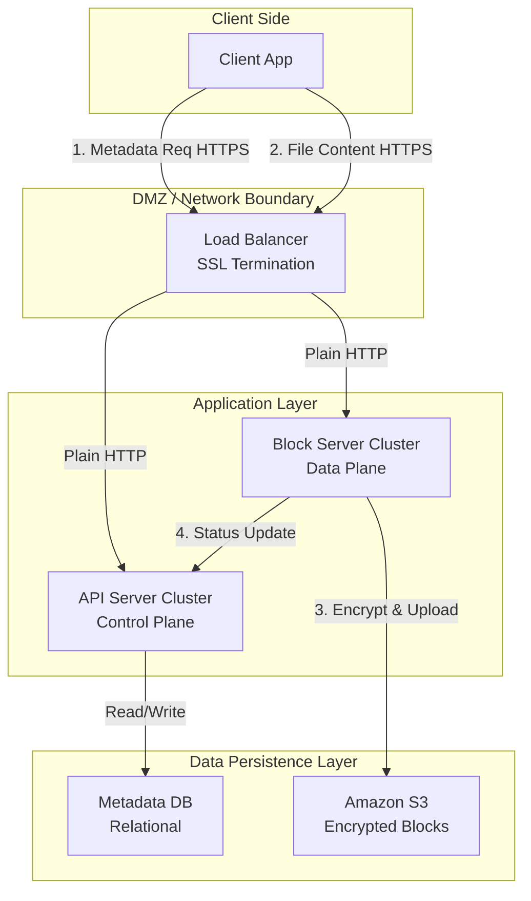
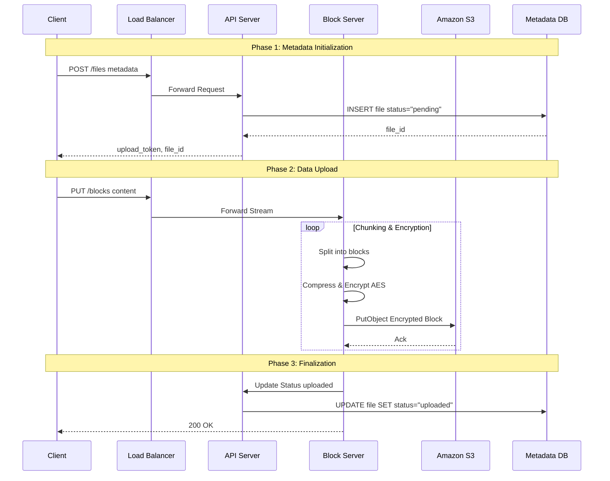
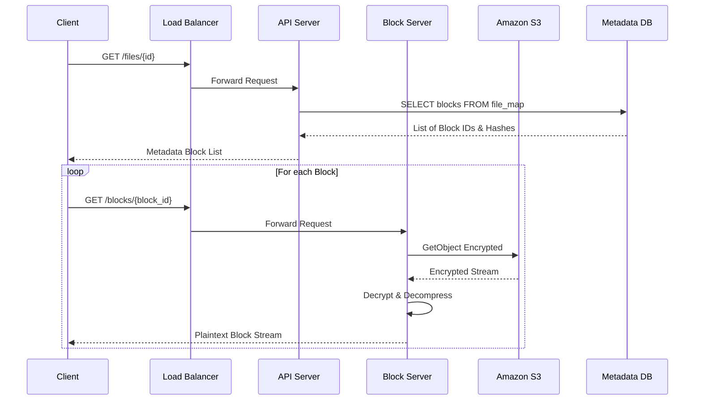

# LLMArchitecture-1.md

# Google Drive System - Architecture Document

## Table of Contents

1. [Introduction](#1-introduction)
2. [Context Diagram](#2-context-diagram)
3. [Architectural Drivers](#3-architectural-drivers)
 - [User Story Priorities](#user-story-priorities)
 - [Quality Attribute Scenario Priorities](#quality-attribute-scenario-priorities)
 - [Architectural Constraints](#architectural-constraints)
4. [Views of the module viewtype](#4-views-of-the-module-viewtype)
5. [Views of the component-and-connector viewtype](#5-views-of-the-component-and-connector-viewtype)
6. [Views of the allocation viewtype](#6-views-of-the-allocation-viewtype)
7. [Sequence Diagrams](#7-sequence-diagrams)
8. [Interfaces](#8-interfaces)
9. [Design Decisions](#9-design-decisions)

## 1. Introduction

This document defines the software architecture for the Google Drive-like system, a scalable file storage and synchronization service. It provides a comprehensive technical blueprint, detailing the system's structure, behavior, and deployment. This document is intended for software engineers, DevOps engineers, and stakeholders to understand the architectural decisions, the decomposition of the system into components, and how these components interact to satisfy the functional requirements (User Stories) and non-functional requirements (Quality Attribute Scenarios) defined in the project scope.

## 2. Context Diagram

The following diagram illustrates the system context for the Google Drive System. It depicts the boundaries of the system and its interactions with external entities (Actors), including the end-users and third-party infrastructure services required for storage (Amazon S3, Glacier) and notifications (Push Service).

### Diagram


	
### External Actors	

| Actor                                     | Description                                                                                                                                                       |
|-------------------------------------------|-------------------------------------------------------------------------------------------------------------------------------------------------------------------|
| User                                      | The primary user of the system who accesses Google Drive via web browsers or mobile applications to upload, download, synchronize, and share files.              |
| Cloud Storage Provider (Amazon S3)        | An external object storage service used to store active file blocks securely. It provides high availability, scalability, and replication.                        |
| Cold Storage Provider (Amazon S3 Glacier) | An external storage service optimized for data archiving. The system moves infrequently used data here to reduce costs.                                           |
| Push Notification Service                 | An external infrastructure service (e.g., APNS, FCM) used to deliver real-time notifications to user mobile devices.                                              |

## 3. Architectural Drivers

This section summarizes the driving requirements for the architecture, derived from the expert analysis of the case study.

### User Story Priorities

| ID      | User Story Name          | Priority | Description                                                      |
|---------|--------------------------|----------|------------------------------------------------------------------|
| US-1.1  | Simple File Upload       | P1       | Core capability to upload files (drag-and-drop, any format).     |
| US-1.2  | Resumable Upload         | P1       | Handling large file uploads (up to 10GB) with resume capability. |
| US-1.3  | File Retrieval           | P1       | Downloading files to local devices.                              |
| US-2.1  | Multi-Device Sync        | P1       | Automatic propagation of file changes across devices.            |
| US-2.2  | Bandwidth Efficient Sync | P1       | Delta synchronization to transfer only modified blocks.          |
| US-2.3  | Conflict Resolution      | P1       | Handling concurrent edits with a "first wins" strategy.          |
| US-3.1  | File Revision History    | P2       | Viewing and restoring previous file versions.                    |
| US-3.2  | File Sharing             | P2       | Sharing files with specific users.                               |
| US-3.3  | Activity Notifications   | P1       | Alerts for file edits, deletions, or shares.                     |

### Quality Attribute Scenario Priorities

| ID       | Scenario Name                           | Quality Attribute    | Priority |
|----------|-----------------------------------------|----------------------|----------|
| QAS-001  | Storage Node Hardware Failure           | Reliability          | P1       |
| QAS-002  | Regional Data Center Outage             | Reliability          | P1       |
| QAS-003  | Network Interruption (Upload)           | Reliability          | P1       |
| QAS-004  | Web/API Server Failure                  | Availability         | P1       |
| QAS-005  | Metadata DB Master Failure              | Availability         | P1       |
| QAS-006  | High Traffic Surge                      | Availability         | P1       |
| QAS-007  | User Base Growth to 50M                 | Scalability          | P1       |
| QAS-008  | Massive Data Accumulation (500 PB)      | Scalability          | P1       |
| QAS-009  | Handling Peak Throughput                | Scalability          | P1       |
| QAS-010  | Delta Synchronization                   | Perf. Efficiency     | P1       |
| QAS-011  | Data Compression                        | Perf. Efficiency     | P2       |
| QAS-012  | Sync Speed / Update Latency             | Perf. Efficiency     | P1       |
| QAS-013  | Cache Invalidation on Write             | Data Consistency     | P1       |
| QAS-014  | Concurrent Edit Conflict Resolution     | Data Consistency     | P1       |
| QAS-015  | ACID Transaction Integrity              | Data Consistency     | P1       |
| QAS-016  | Data Confidentiality at Rest            | Security             | P1       |
| QAS-017  | Data Security in Transit                | Security             | P1       |
| QAS-018  | Unauthorized Access Control             | Security             | P1       |

### Architectural Constraints

| ID   | Constraint             | Description                                                                            |
|------|------------------------|----------------------------------------------------------------------------------------|
| C-1  | Technology Stack       | Must use Amazon S3, S3 Glacier, Relational DB (ACID), and Long Polling.                |
| C-2  | Business Rules         | Max file size 10GB; 10GB free space/user; Google Doc editing is out of scope.          |
| C-3  | Security & Consistency | Encryption at rest; HTTPS/SSL in transit; Strong Consistency required.                 |

**Key Priorities for Current Architecture:**

  * **US-1.1**: Simple File Upload (P1)
  * **US-1.3**: File Retrieval (P1)
  * **QAS-016**: Data Confidentiality at Rest (P1)
  * **QAS-017**: Data Security in Transit (P1)

## 4. Views of the module viewtype

*(Section currently empty - Reserved for Code Structure/Classes)*

## 5. Views of the component-and-connector viewtype

### 5.1 Core System Decomposition (Service-Based Architecture)

This view illustrates the separation of the system into a **Control Plane** (handling metadata and user interactions) and a **Data Plane** (handling file content processing). This separation is critical for scaling the CPU-intensive encryption tasks independently of the IO-intensive metadata tasks.



#### Component Responsibilities

| Component | Responsibilities |
| :--- | :--- |
| **Client Application** | Initiates upload/download requests; handles user interactions. |
| **Load Balancer** | Distributes traffic; performs **SSL Termination** to satisfy QAS-017. |
| **API Server** | Authenticates users; manages file **Metadata** (name, size, owner); orchestrates status updates. |
| **Block Server** | Receives file streams; **Splits** files into blocks; **Encrypts** blocks (QAS-016); Uploads to S3. |
| **Metadata DB** | Stores relational data (User, File, Block mappings); ensures ACID compliance. |
| **Cloud Storage (S3)** | Persists encrypted file blocks; ensures high durability. |

## 6. Views of the allocation viewtype

*(Section currently empty - Reserved for Deployment/Infrastructure)*

## 7. Sequence Diagrams

This section details the dynamic behavior of the system for the critical User Stories and Quality Attribute Scenarios identified in the Iteration Plan.

### 7.1 Iteration 1 Drivers (Core Structure)

#### US-1.1: Simple File Upload

This sequence demonstrates the split flow: Metadata first, then Data.



#### US-1.3: File Retrieval (Download)



#### QAS-016: Data Confidentiality at Rest (Encryption)

```mermaid
sequenceDiagram
    %% Empty placeholder for QAS-016 sequence
```

#### QAS-017: Data Security in Transit

```mermaid
sequenceDiagram
    %% Empty placeholder for QAS-017 sequence
```

### 7.2 Iteration 2 Drivers (Sync & Consistency)

#### US-2.1: Multi-Device Synchronization

```mermaid
sequenceDiagram
    %% Empty placeholder for US-2.1 sequence
```

#### US-2.2 / QAS-010: Bandwidth Efficient Sync (Delta Sync)

```mermaid
sequenceDiagram
    %% Empty placeholder for US-2.2/QAS-010 sequence
```

#### US-2.3: Conflict Resolution

```mermaid
sequenceDiagram
    %% Empty placeholder for US-2.3/QAS-014 sequence
```

#### US-3.3: Activity Notifications

```mermaid
sequenceDiagram
    %% Empty placeholder for US-3.3 sequence
```

#### QAS-012: Sync Speed / Update Latency

```mermaid
sequenceDiagram
    %% Empty placeholder for QAS-012 sequence
```

#### QAS-013: Cache Invalidation on Write

```mermaid
sequenceDiagram
    %% Empty placeholder for QAS-013 sequence
```

### 7.3 Iteration 3 Drivers (Reliability & Scale)

#### US-1.2 / QAS-003: Resumable Upload for Large Files

```mermaid
sequenceDiagram
    %% Empty placeholder for US-1.2/QAS-003 sequence
```
	
#### QAS-001: Storage Node Hardware Failure

```mermaid
sequenceDiagram
    %% Empty placeholder for QAS-001 sequence
```
	
#### QAS-002: Regional Data Center Outage

Snippet de código

```mermaid
sequenceDiagram
    %% Empty placeholder for QAS-002 sequence
```
	
#### QAS-004: Web/API Server Failure

Snippet de código

```mermaid
sequenceDiagram
    %% Empty placeholder for QAS-004 sequence
```
	
#### QAS-005: Metadata Database Master Failure

Snippet de código

```mermaid
sequenceDiagram
    %% Empty placeholder for QAS-005 sequence
```
	
#### QAS-006 / QAS-009: High Traffic Surge & Peak Throughput

Snippet de código

```mermaid
sequenceDiagram
    %% Empty placeholder for QAS-006/QAS-009 sequence
```
	
#### QAS-007: User Base Growth to 50 Million

Snippet de código

```mermaid
sequenceDiagram
    %% Empty placeholder for QAS-007 sequence
```
	
#### QAS-008: Massive Data Accumulation

Snippet de código

```mermaid
sequenceDiagram
    %% Empty placeholder for QAS-008 sequence
```
	
### 7.4 Iteration 4 Drivers (Security & Optimization)

#### US-3.1: File Revision History

Snippet de código

```mermaid
sequenceDiagram
    %% Empty placeholder for US-3.1 sequence
```
	
#### US-3.2: File Sharing

Snippet de código

```mermaid
sequenceDiagram
    %% Empty placeholder for US-3.2 sequence
```
	
#### QAS-011: Data Compression

Snippet de código

```mermaid
sequenceDiagram
    %% Empty placeholder for QAS-011 sequence
```
	
#### QAS-015: ACID Transaction Integrity

Snippet de código

```mermaid
sequenceDiagram
    %% Empty placeholder for QAS-015 sequence
```
	
#### QAS-018: Unauthorized Access Control

Snippet de código

```mermaid
sequenceDiagram
    %% Empty placeholder for QAS-018 sequence
```

## 8. Interfaces

### 8.1 API Server Interfaces

#### I-01: File Metadata API

  * **Protocol**: REST / HTTPS
  * **Function**: Initializes file upload.
  * **Input**: JSON `{"name": "doc.pdf", "folder_id": "root"}`
  * **Output**: JSON `{"file_id": "uuid", "status": "pending"}`

### 8.2 Block Server Interfaces

#### I-02: Block Upload API

  * **Protocol**: REST / HTTPS
  * **Function**: Accepts binary file streams.
  * **Headers**: `Authorization: Bearer <token>`, `X-File-Id: <uuid>`
  * **Body**: Binary Data

## 9. Design Decisions

### 9.1 Iteration 1 Decisions

| Driver | Decision | Rationale | Discarded Alternative |
| :--- | :--- | :--- | :--- |
| **US-1.1, QAS-009** | **Separation of API & Block Servers** | Decouples CPU-heavy encryption/compression logic (Block Server) from IO-bound metadata logic (API Server), allowing independent scaling. | **Monolithic Arch**: Cannot scale resources independently. |
| **US-1.1, US-2.2** | **Block-Based Storage** | Splitting files enables parallel uploads, granular encryption, and future optimizations like Delta Sync. | **Whole File Storage**: Inefficient for large file updates. |
| **QAS-016** | **Server-Side Encryption (Block Server)** | Centralizes security control. Avoids reliance on client-side implementation which is error-prone across multiple platforms (iOS/Android/Web). | **Client-Side Encryption**: Too complex to maintain consistency across platforms. |
| **QAS-016** | **Proxy Upload (Client -\> Block -\> S3)** | Required to perform server-side chunking and encryption. | **Direct S3 Upload**: Forces client to handle chunking/encryption, increasing client complexity. |

