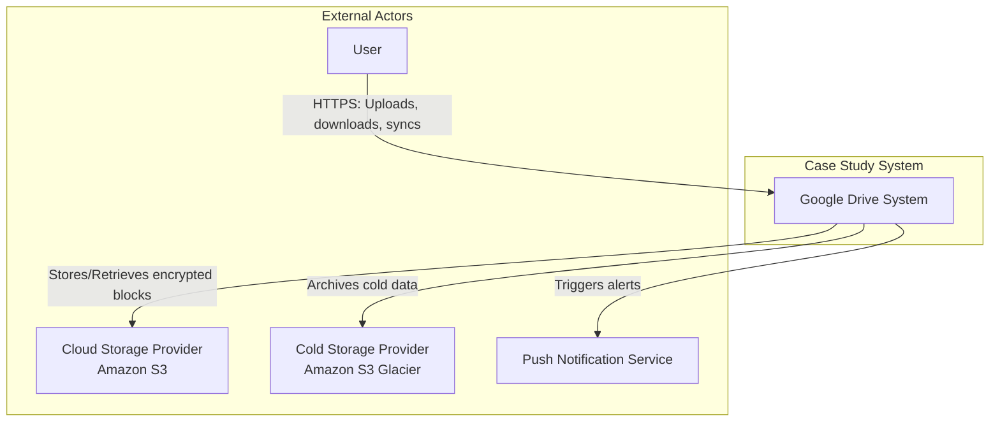
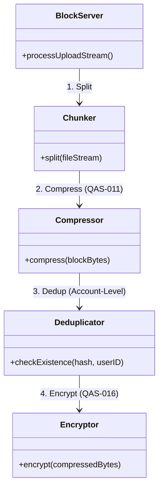
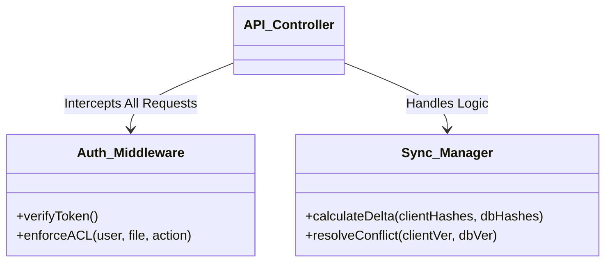
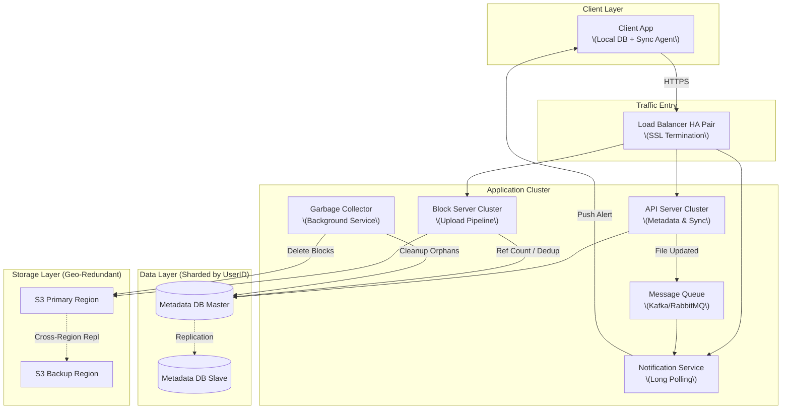
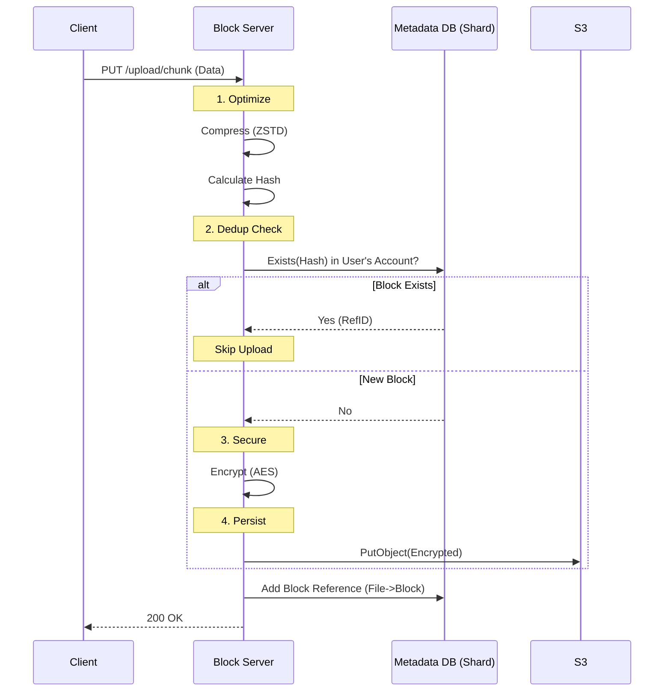
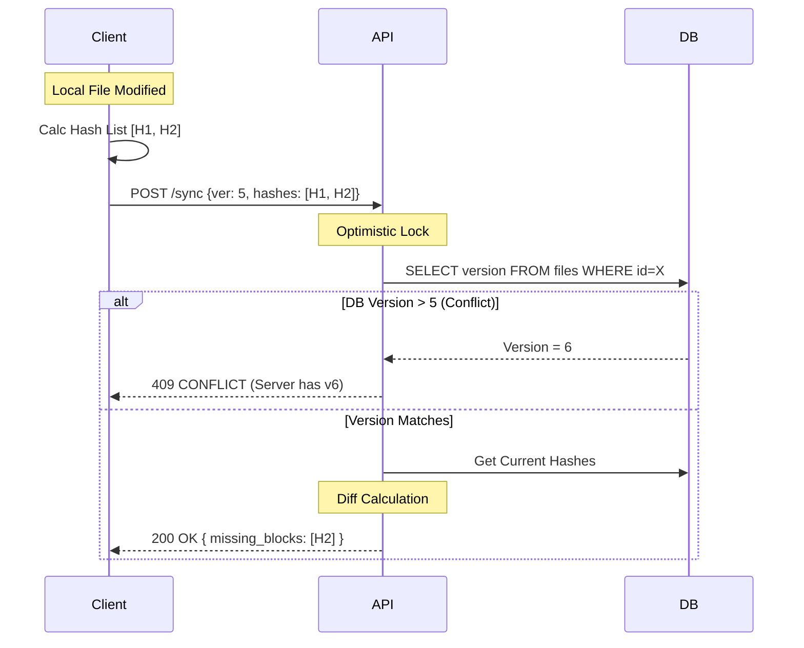
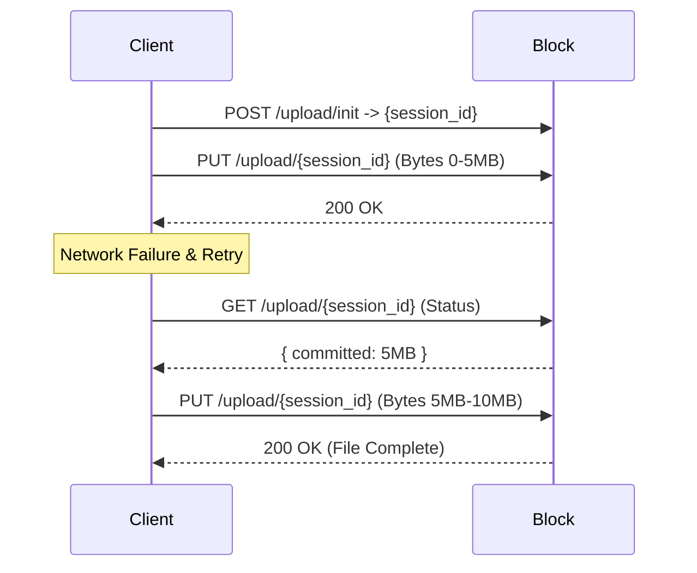

# LLMArchitectureFinal.md

# Google Drive System - Final Architecture Document

## Table of Contents

1.  [Introduction](https://www.google.com/search?q=%231-introduction)
2.  [Context Diagram](https://www.google.com/search?q=%232-context-diagram)
3.  [Architectural Drivers](https://www.google.com/search?q=%233-architectural-drivers)
4.  [Views of the Module Viewtype](https://www.google.com/search?q=%234-views-of-the-module-viewtype)
5.  [Views of the Component-and-Connector Viewtype](https://www.google.com/search?q=%235-views-of-the-component-and-connector-viewtype)
6.  [Views of the Allocation Viewtype](https://www.google.com/search?q=%236-views-of-the-allocation-viewtype)
7.  [Sequence Diagrams](https://www.google.com/search?q=%237-sequence-diagrams)
8.  [Interfaces](https://www.google.com/search?q=%238-interfaces)
9.  [Design Decisions](https://www.google.com/search?q=%239-design-decisions)

-----

## 1\. Introduction

This document presents the comprehensive software architecture for the Google Drive-like system. It is the result of four design iterations using Attribute-Driven Design (ADD). The system is designed to be a secure, scalable, and reliable file storage and synchronization service capable of supporting **10 million Daily Active Users (DAU)** and storing **500 Petabytes** of data.

The architecture moves beyond a simple client-server model to a **distributed system** utilizing sharding, replication, block-level storage, and event-driven synchronization to meet strict consistency and availability requirements.

-----

## 2\. Context Diagram

The system interacts with users via mobile and web clients and leverages third-party cloud infrastructure for raw storage and push notifications.

-----

## 3\. Architectural Drivers

The following drivers were prioritized and shaped the final design:

### Key Functional Requirements (User Stories)

  * **US-1.1 Simple Upload & US-1.3 Download**: Core IO operations.
  * **US-1.2 Resumable Uploads**: Critical for large files (10GB) over unstable networks.
  * **US-2.1 & US-2.2 Synchronization**: Multi-device propagation using bandwidth-efficient **Delta Sync**.
  * **US-3.2 File Sharing**: Granular access control between users.

### Key Quality Attribute Scenarios

  * **Scalability (QAS-008)**: Must handle 500PB of data. -\> \* drove the decision for **Database Sharding**.
  * **Reliability (QAS-001/002)**: Zero data loss; Regional outage survival. -\> \* drove **S3 Cross-Region Replication**.
  * **Consistency (QAS-014)**: Strong consistency for file versions. -\> \* drove **Optimistic Locking**.
  * **Security (QAS-016/018)**: Encryption at rest and strict ACLs. -\> \* drove **Server-Side Encryption**.
  * **Efficiency (QAS-011)**: Cost reduction. -\> \* drove **Compression & De-duplication**.

-----

## 4\. Views of the Module Viewtype

This view exposes the internal logic structure of the primary servers, highlighting the optimization pipeline and security middleware.

### 4.1 Block Server Pipeline (Optimization & Security)

The Block Server is designed as a pipeline to ensure data efficiency *before* security obscuration.

### 4.2 API Server Logic (Control Plane)

The API Server handles the "Business Logic" and enforces permissions before any operation is processed.

-----

## 5\. Views of the Component-and-Connector Viewtype

### 5.1 Final System Topology

This is the runtime view of the deployed system. It illustrates the separation of the **Data Plane** (Block Servers) from the **Control Plane** (API Servers), the **Sharded Database** layer, and the **Async Notification** system.

### 5.2 Component Responsibilities

| Component | Role | Key Responsibilities |
| :--- | :--- | :--- |
| **Load Balancer** | Gateway | SSL Termination, Health Checks, Traffic Distribution. |
| **API Server** | Control Plane | Authentication, **ACL Checks**, **Sharding Router**, Delta Calculation, Version Control. |
| **Block Server** | Data Plane | Chunking, **Compression**, **Encryption**, **De-duplication**, S3 Interaction. |
| **Notification Svc**| Real-time | Manages **Long Polling** connections; pushes updates to clients. |
| **Metadata DB** | State Store | Stores User/File/Block metadata. **Sharded by User ID**. |
| **S3 Storage** | Persistence | Stores encrypted, immutable file blocks. |
| **Garbage Collector**| Maintenance | Asynchronously deletes blocks with `ref_count = 0` (orphaned by edits/deletes). |

-----

## 6\. Views of the Allocation Viewtype

### 6.1 Deployment & Technologies

| Tier | Technology Choice | Rationale |
| :--- | :--- | :--- |
| **Frontend** | Web (React/Vue), Mobile (iOS/Android) | Native apps required for local FS access and background sync. |
| **Service Layer** | Go or Java | High concurrency support for Block Servers (Streaming) and API. |
| **Database** | Relational (PostgreSQL/MySQL) | **ACID** compliance required for complex metadata updates (versions/sharing). |
| **Storage** | Amazon S3 + Glacier | Industry standard for durability, scale, and lifecycle policies. |
| **Messaging** | Kafka / RabbitMQ | Decouples high-throughput writes from notification delivery. |

-----

## 7\. Sequence Diagrams

### 7.1 Optimized Upload Flow (Compression + Dedup + Security)

This diagram represents the final logic for **US-1.1** and **Optimization Drivers**.

### 7.2 Delta Sync & Conflict Resolution

This represents the core logic for **US-2.2** and **US-2.3**.

### 7.3 Resumable Upload (Failure Handling)

Represents **US-1.2** and **Reliability**.

-----

## 8\. Interfaces

### Core API Catalogue

1.  **File Metadata API** (`POST /files`): Create file entries.
2.  **Block Upload API** (`PUT /upload/chunk`): Stream binary data.
3.  **Resumable Session API** (`POST /upload/init`, `GET /upload/status`): Manage unstable uploads.
4.  **Sync API** (`POST /files/sync`): Send hash lists, receive missing block IDs.
5.  **Polling API** (`GET /notifications/poll`): Long-polling endpoint for real-time alerts.
6.  **Sharing API** (`POST /files/{id}/share`): Update ACLs.

-----

## 9\. Design Decisions

This log consolidates the major decisions made throughout the design process.

| Category | Decision | Rationale | Discarded Alternative |
| :--- | :--- | :--- | :--- |
| **Architecture** | **Separation of Data & Control Planes** | Block Servers (CPU/Bandwidth heavy) must scale independently of API Servers (IO/Logic heavy). | Monolithic Server. |
| **Storage** | **Block-Level Storage** | Splitting files enables Delta Sync, Parallel Uploads, and De-duplication. | Whole File Storage. |
| **Scalability** | **Sharding by User ID** | Ensures all metadata for a user is on one node, making "List Files" fast. Enables scaling to 500PB. | Sharding by File ID (Scatter-gather query perf is poor). |
| **Consistency** | **Optimistic Locking (Versioning)** | Enforces "First-Write-Wins" to prevent data corruption during concurrent edits. | Last-Write-Wins (Data loss risk). |
| **Security** | **Server-Side Encryption** | Centralizes key management and encryption logic, reducing risk of client-side implementation errors. | Client-Side Encryption. |
| **Security** | **ACL (Access Control List)** | Required for granular, user-to-user sharing of specific files. | RBAC (Too broad for personal drive). |
| **Optimization** | **Account-Level De-duplication** | Saves storage for version history while preserving user privacy (prevents side-channel attacks). | Global De-duplication (Privacy risk). |
| **Optimization** | **Compression BEFORE Encryption** | Encrypted data is high-entropy and cannot be compressed. Order of operations is critical. | Encrypt then Compress. |
| **Connectivity** | **Long Polling** | Required by constraints. Efficient for uni-directional, infrequent server-to-client notifications. | WebSockets (Constraint C-1). |