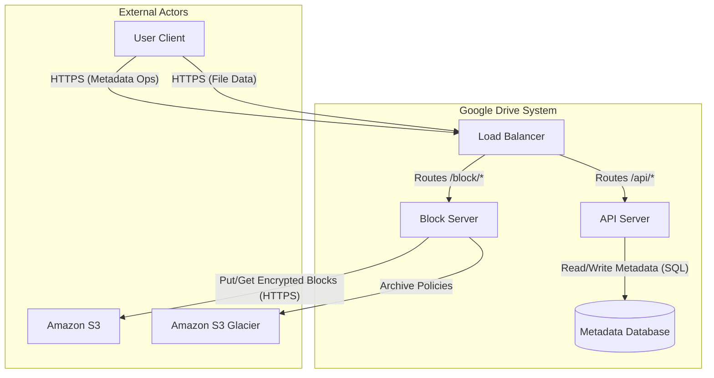

# LLMIteration-1.md

# Iteration 1: Core System Structure & Basic Data Flow

## Step 1: Review Inputs

**Design Round Purpose**:  
The purpose of this design round is to produce a structural design that supports the core lifecycle of a file (Upload -> Store -> Download) while strictly adhering to security constraints (Encryption). This will involve defining the high-level decomposition of the system into major containers.

**Primary Drivers for this Iteration**:

| ID | Driver | Priority | Source |
|:---|:-------|:---------|:-------|
| **US-1.1**  | **Simple File Upload**: Users must upload files of any format via drag-and-drop. | **P1** | |
| **US-1.3**  | **File Retrieval**: Users must download stored files to local devices. | **P1** | |
| **QAS-016** | **Data Confidentiality at Rest**: All files must be encrypted before storage. | **P1** | |
| **QAS-017** | **Data Security in Transit**: All transfers must be HTTPS/SSL. | **P1** | |

**Relevant Constraints**:
* **C-1 (Tech Stack)**: Must use Amazon S3 for storage and a Relational Database for metadata.
* **C-3 (Security)**: Mandatory Encryption at rest and SSL in transit.

**Existing Architecture**:
* We are starting with the **Context Diagram** defined in `LLMArchitecture-0.md`. There are no internal structures defined yet.

## Step 2: Establish Iteration Goal by Selecting Drivers

**Goal**:  
The goal of this iteration is to decompose the high-level "Google Drive System" into its primary **containers** (functional subsystems). We aim to establish a pattern that separates the handling of large file data (Block Server) from metadata and user management (API Server), while satisfying the requirement for data confidentiality (Encryption) immediately at the entry point.

**Selected Drivers**:
* **US-1.1**: Simple File Upload.
* **US-1.3**: File Retrieval (Download).
* **QAS-016**: Data Confidentiality at Rest (Encryption).
* **QAS-017**: Data Security in Transit.

## Step 3: Choose One or More Elements of the System to Refine

**Element to Refine**:  
We will refine the **Google Drive System** element, which is currently represented as a single "Black Box" in the System Context Diagram.

**Refinement Strategy**:  
**Decomposition**. We will break the system down into key containers (Applications and Data Stores) to support the flow of metadata and binary data.

## Step 4: Choose One or More Design Concepts That Satisfy the Selected Drivers

**Design Decision 1: Separation of Concerns (Metadata vs. Block Data)**
* **Decision**: We will separate the system into two distinct service types: **API Servers** for lightweight metadata operations and **Block Servers** for heavy file processing.
* **Rationale**: This addresses **US-1.1 (Upload)** and **QAS-016 (Encryption)**. File processing (chunking, compression, encryption) is CPU and I/O intensive. Separating it from metadata operations ensures that heavy uploads do not starve user requests for file listings or logins. It also allows independent scaling.

**Design Decision 2: Object Storage for Files**
* **Decision**: Use **Amazon S3** for storing the actual file blocks.
* **Rationale**: Satisfies **Constraint C-1**. S3 provides the necessary durability and availability for the "Data" part of the system.

**Design Decision 3: Relational Database for Metadata**
* **Decision**: Use a **Relational Database** (e.g., MySQL/PostgreSQL) for storing user and file metadata.
* **Rationale**: Satisfies **Constraint C-1** and provides ACID properties required for consistency.

**Design Decision 4: Encryption at the Service Layer**
* **Decision**: Implement encryption logic within the **Block Server** before data is sent to S3.
* **Rationale**: Satisfies **QAS-016**. While S3 supports server-side encryption, performing it in the Block Server ensures we control the keys and the process before data leaves our compute boundary.

## Step 5: Instantiate Architectural Elements, Allocate Responsibilities, and Define Interfaces

**Instantiation 1: Block Server**
* **Responsibilities**:
    * Receive file content from clients.
    * Split files into blocks.
    * Compress blocks (Implementation of **QAS-011** - *noted here as part of standard block processing*).
    * **Encrypt** blocks (Implementation of **QAS-016**).
    * Upload encrypted blocks to **Amazon S3**.
* **Relationships**: Connects to Client (Input) and Amazon S3 (Output).

**Instantiation 2: API Server**
* **Responsibilities**:
    * Authenticate users (**US-1.1** precondition).
    * Manage file metadata (name, size, parent folder, version).
    * Generate/Manage Upload URLs or sessions.
    * Update **Metadata DB** with new file status.
* **Relationships**: Connects to Client (Requests) and Metadata DB (Storage).

**Instantiation 3: Load Balancer**
* **Responsibilities**:
    * Distribute incoming HTTPS traffic to appropriate servers (API vs Block) based on URL path or subdomain.
    * Terminate SSL (**QAS-017**).
* **Relationships**: Intermediary between Client and Backend Servers.

**Instantiation 4: Metadata Database**
* **Responsibilities**:
    * Persist user info, file metadata, and block mappings.
* **Relationships**: Accessed primarily by API Servers.

**Defined Interfaces (Preliminary)**:
* `I_Upload`: Client -> Block Server (Binary Data Stream over HTTPS).
* `I_Metadata`: Client -> API Server (JSON over HTTPS).
* `I_Storage`: Block Server -> Amazon S3 (S3 API/HTTPS).

## Step 6: Sketch Views and Record Design Decisions

**Sketch: Container Diagram (C4 Level 2)** This diagram visualizes the decomposition of the "Google Drive System" into its core containers. It highlights the separation between metadata handling and file block processing.

**Recorded Design Decisions**:

| Driver | Decision | Rationale | Discarded Alternative |
|:---|:---|:---|:---|
| **US-1.1, US-1.3** | **Separation of API and Block Servers** | Separating heavy I/O (file blocks) from lightweight requests (login, metadata) prevents resource starvation. It allows the Block Servers to be scaled independently based on bandwidth/CPU needs (compression/encryption). | **Monolithic Architecture**: Discarded because heavy uploads would block simple metadata queries, leading to poor availability under load. |
| **QAS-016** | **Service-Side Encryption in Block Server** | Performing encryption in the Block Server (before S3) ensures strict control over encryption keys and process integrity. It satisfies the requirement to store encrypted data. | **Client-Side Encryption**: Discarded due to trust issues; compromised clients could upload corrupt data. **S3-Server Side Encryption Only**: Discarded as it relies wholly on the provider; we need application-level control. |
| **C-1** | **Use Amazon S3** | Constraint from the Case Study. Provides necessary durability (99.999999999%) and scalability. | **HDFS / Custom Storage Cluster**: Discarded due to high operational complexity and cost compared to managed S3. |

**Architect's Note:**
We have now crystallized the architecture. The "Google Drive System" is no longer a black box; it is a coordinated set of services. The diagram clearly shows how we handle the two distinct types of traffic (Metadata vs. Data) to satisfy our primary drivers.

## Step 7: Perform Analysis of Current Design and Review Iteration Goal

**Analysis of Design**:
The architecture now consists of a **Split-Service Pattern**.
1.  **Functionality**: The **API Server** handles metadata, ensuring that `US-1.1` (Simple Upload) and `US-1.3` (Download) have a responsive entry point for authentication and file listing. The **Block Server** handles the heavy lifting, satisfying the throughput needs.
2.  **Security**: By placing the **Block Server** as the gatekeeper to S3, we enforce **QAS-016** (Encryption). The client cannot write directly to S3, preventing unencrypted data ingress. **QAS-017** (Transit) is enforced via the Load Balancer.
3.  **Constraints**: The use of S3 and Relational DB satisfies **C-1**.

**Goal Status**:
The goal of "Establishing Core System Structure" is **Achieved**. We have decomposited the system into deployable containers.

**Driver Status Update**:

| Driver | Status | Notes |
|:---|:---|:---|
| **US-1.1** (Simple Upload) | **Completely Addressed** | Structure allows upload. Large file logic (Resumable) is next. |
| **US-1.3** (Download) | **Completely Addressed** | Structure supports retrieval of blocks and metadata. |
| **QAS-016** (Encryption) | **Completely Addressed** | Encryption layer defined in Block Server. |
| **QAS-017** (Transit Security) | **Completely Addressed** | LB/SSL Termination defined. |

---

# LLMIteration-1.md

# Iteration 1: Core System Structure & Basic Data Flow

## Step 1: Review Inputs

**Design Round Purpose**:  
The purpose of this design round is to produce a structural design that supports the core lifecycle of a file (Upload -> Store -> Download) while strictly adhering to security constraints (Encryption).

**Primary Drivers**:
* **US-1.1**: Simple File Upload (P1).
* **US-1.3**: File Retrieval (P1).
* **QAS-016**: Data Confidentiality at Rest (P1).
* **QAS-017**: Data Security in Transit (P1).

**Constraints**:
* **C-1**: Tech Stack (S3, RDBMS).

## Step 2: Establish Iteration Goal by Selecting Drivers

**Goal**:  
Decompose the high-level system into primary containers to separate large file processing from metadata management.

## Step 3: Choose One or More Elements of the System to Refine

**Element**: Google Drive System (System Context).
**Strategy**: Decomposition into Containers.

## Step 4: Choose One or More Design Concepts That Satisfy the Selected Drivers

**Design Decision 1: Separation of Concerns (Metadata vs. Block Data)**
* **Decision**: Separate API Servers (Metadata) and Block Servers (Data).
* **Rationale**: prevents resource starvation during heavy uploads.

**Design Decision 2: Object Storage**
* **Decision**: Use Amazon S3.
* **Rationale**: Satisfies C-1 and provides durability.

**Design Decision 3: Encryption Service**
* **Decision**: Encrypt in Block Server before S3 write.
* **Rationale**: Satisfies QAS-016 with application-controlled keys.

## Step 5: Instantiate Architectural Elements

* **Block Server**: Handling chunking, compression, encryption, S3 interaction.
* **API Server**: Handling Auth, Metadata, DB interaction.
* **Load Balancer**: SSL termination, Routing.
* **Metadata DB**: Storing file/user info.

## Step 6: Sketch Views and Record Design Decisions

*See Container Diagram in LLMArchitecture-1.md*

## Step 7: Perform Analysis of Current Design

The split architecture successfully addresses the drivers. All selected drivers for this iteration are marked as **Completely Addressed**.