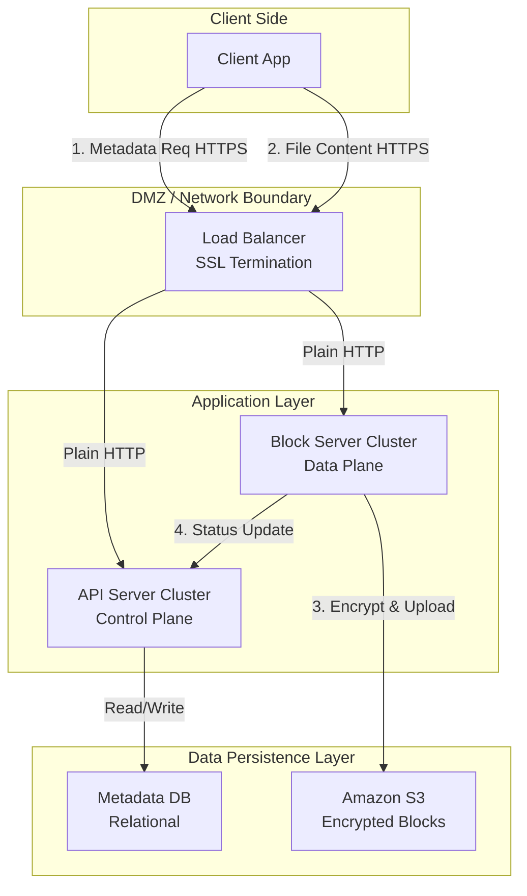

# LLMIteration-1.md

## Step 1: Review Iteration Goal and Drivers

**Goal:** Establish the global architectural pattern and facilitate the fundamental ability to store and retrieve files securely. This iteration defines the decomposition into major containers (Block Server, API Server, Metadata DB) and handles the interaction with external storage (S3).

**Drivers to Address:**

- **User Stories:**

	- *US-1.1:* Simple File Upload. (Priority: P1)
		- Description: Users must be able to upload files of any format via a drag-and-drop interface.

	- *US-1.3:* File Retrieval (Download). (Priority: P1)
		- Description: Users must be able to download stored files to their local devices.

- *Quality Attribute Scenarios:*

	- *QAS-016:* Data Confidentiality at Rest (Encryption). (Priority: P1)
		- Scenario: The system ensures that all file blocks are encrypted by the Block Servers before being committed to storage.

	- *QAS-017:* Data Security in Transit. (Priority: P1)
		- Scenario: The system enforces the use of HTTPS/SSL for all API calls and data transfers to prevent man-in-the-middle attacks.

- *Constraints:*

	- *C-1:* Technology Stack. Must use Amazon S3 for storage and a Relational Database for metadata.

	- *C-3:* Security & Data Management. Encryption at rest and HTTPS are mandatory.

***

**Architect's Note:** We are intentionally excluding complex features like synchronization (US-2.x) and resumable uploads (US-1.2) for this iteration. Our focus is purely on the "happy path" of moving data securely between the client and the cloud infrastructure.

***

## Step 2: Establish Goal for the Iteration by Selecting Drivers

**Goal:** Define the foundational architectural style and deployable units required to securely transport data from a user's device to persistent cloud storage and retrieve it. This involves defining the boundaries between the client, the application servers, and the storage infrastructure.

**Rationale for Driver Selection:** We have selected the following drivers because they represent the "Critical Path" for the system. Until we can prove we can securely accept and store a file, no other feature (synchronization, sharing) matters.

**Selected Drivers:**

1. *US-1.1: Simple File Upload*
	- Why: This defines the primary input for the system. It forces us to decide how data enters the architecture (e.g., via API or direct to storage).

2. *US-1.3: File Retrieval (Download)*
	- Why: This defines the primary output. It forces us to design the retrieval path and how the client interacts with stored data.

3. *QAS-016: Data Confidentiality at Rest (Encryption)*
	- Why: This is a P1 security requirement. Addressing it now ensures security is "baked in" to the data flow rather than bolted on later. It impacts component responsibilities (who performs the encryption?).

4. *QAS-017: Data Security in Transit*
	- Why: This dictates our communication protocols (HTTPS/SSL) and affects interface definitions.

***

**Architect's Note:** By selecting US-1.1 and QAS-016 together, we are acknowledging a critical design trade-off we must face in the next steps: Where does encryption happen? (Client-side vs. Server-side). This decision will fundamentally shape our Component-and-Connector view.

***

## Step 3: Choose One or More Elements of the System to Refine

**Element to Refine**: The entire **Google Drive System** (currently represented as a black box in the Context Diagram).

**Refinement Strategy**:

- **Decomposition**. We will break the monolithic system into distinct subsystems to separate the "Data Plane" (handling heavy file content) from the "Control Plane" (handling metadata and user requests).

**Rationale**: To satisfy **US-1.1 (Upload)** and **QAS-016 (Encryption at Rest)** efficiently, we cannot process heavy file data and lightweight metadata in the same pipeline. The expert analysis suggests separating these concerns to handle the differing resource requirements (CPU/Bandwidth for files vs. IO/Transactional integrity for metadata).

**Sub-Elements to be Defined**: Based on the functional requirements, we expect to identify the following core components during this refinement:

1.  **Client Application**: The interface for the user.
2.  **Load Balancer**: The entry point for traffic.
3.  **API Server**: To handle metadata and authentication.
4.  **Block Server**: A dedicated component to handle file chunking, compression, and encryption.
5.  **Metadata Database**: To store file revisions and user data.

***

**Architect's Note**: By choosing to decompose the system now, we are preparing to assign specific responsibilities (like encryption QAS-016) to the **Block Server** specifically, rather than overloading the API Server.

***

## Step 4: Choose One or More Design Concepts That Satisfy the Selected Drivers

For this iteration, we have selected the following design concepts to address the upload, download, and security drivers:

### 1. Service-Based Architecture (Separation of Data and Control Planes)
* **Description**: We will split the backend into two distinct service types: **API Servers** (Control Plane) and **Block Servers** (Data Plane).
* **Drivers Addressed**:
    * **US-1.1 (Upload)**: Allows optimizing servers specifically for heavy I/O and CPU tasks (hashing/encrypting) separate from lightweight user requests.
    * **QAS-016 (Encryption)**: Centralizes the encryption logic in the Block Server.
* **Rationale**: Separating concerns allows the system to handle the heavy load of file processing (chunking, compressing, encrypting) without blocking the responsive API endpoints used for metadata.

### 2. Block-Based File Storage Strategy
* **Description**: Files will not be stored as single objects. They will be split into smaller blocks, each with a unique hash.
* **Drivers Addressed**:
    * **US-1.1 (Upload)** & **US-1.3 (Download)**.
* **Rationale**: Breaking files into blocks enables efficient storage in S3 and provides the granular unit required for encryption. It also lays the groundwork for future requirements like Delta Sync (US-2.2) and De-duplication.

### 3. Server-Side Encryption (at Block Server)
* **Description**: The **Block Server** will be responsible for encrypting file blocks before sending them to S3 and decrypting them upon retrieval.
* **Drivers Addressed**:
    * **QAS-016 (Data Confidentiality at Rest)**.
* **Rationale**: Centralizes security logic. While client-side encryption is safer, it makes cross-platform implementation (Web, iOS, Android) error-prone and complex. The case study explicitly identifies moving this logic to Block Servers as the preferred design.

### 4. HTTPS/SSL Termination at Load Balancer
* **Description**: All traffic from clients will be encrypted via TLS/SSL, terminated at the entry load balancer.
* **Drivers Addressed**:
    * **QAS-017 (Data Security in Transit)**.
* **Rationale**: Standard industry practice to offload the cryptographic overhead of handshake negotiation from the application servers to the load balancer.

### Discarded Alternatives

| Alternative | Reason for Discarding |
| :--- | :--- |
| **Direct Upload to S3 (Pre-signed URLs)** | While this reduces server load, it forces the client to handle chunking, compression, and encryption. As noted in the case study, implementing this sensitive logic across multiple client platforms (Web, iOS, Android) is error-prone and requires significant engineering effort. |
| **Monolithic Single Server** | Discarded immediately as it violates the scalability and reliability requirements inherent in the project scope (10M DAU). |

***

**Architect's Note**:
The decision to discard "Direct Upload to S3" is the most significant decision in this iteration. It forces us to build the **Block Server**, which increases infrastructure complexity but simplifies client logic and ensures consistent security enforcement.

***

## Step 5: Instantiate Architectural Elements, Sketch Views, Allocate Responsibilities, and Define Interfaces

We have instantiated the following elements to form the **Component-and-Connector** structure of the system.

### 1\. Instantiated Elements & Responsibilities

| Element | Type | Responsibilities | Design Concept / Driver |
| :--- | :--- | :--- | :--- |
| **Client Application** | Component | - Initiates upload/download requests. - Handling user interactions. | US-1.1 |
| **Load Balancer** | Connector | - Distributes traffic. - **SSL Termination** (Decryption of inbound HTTPS traffic). | QAS-017 (Security in Transit) |
| **API Server** | Component | - Authenticates users. - Manages file **Metadata** (name, size, owner) in the DB. - Updates file status (pending -\> uploaded). | Service-Based Arch |
| **Block Server** | Component | - Receives file content streams. - **Splits** files into blocks. - **Encrypts** blocks (AES). - Uploads blocks to Cloud Storage. | QAS-016 (Encryption), Block-Based Storage |
| **Metadata DB** | Component | - Stores user and file metadata relations. - Ensures ACID compliance for metadata updates. | Relational DB Constraint |
| **Cloud Storage (S3)** | Component | - Persists encrypted file blocks. - Ensures durability and availability. | S3 Constraint |

### 2\. Sketch of the Component-and-Connector View

This diagram illustrates the separation between the Control Plane (API Server) and Data Plane (Block Server).

### 3\. Key Interface Definitions

To satisfy the interaction between these components, we define the following preliminary interfaces:

**I-01: File Metadata API (Provided by API Server)**

  * **Endpoint**: `POST /api/v1/files`
  * **Input**: `JSON { name: "photo.jpg", size: 1024, parent_folder_id: "xyz" }`
  * **Output**: `JSON { file_id: "123", upload_status: "pending", upload_token: "abc" }`
  * **Rationale**: Establishes the file entry in the database before any data is transmitted.

**I-02: Block Upload API (Provided by Block Server)**

  * **Endpoint**: `PUT /api/v1/blocks/upload`
  * **Headers**: `Authorization: Bearer <token>`, `X-File-Id: <file_id>`
  * **Body**: `Binary Stream (File Content)`
  * **Rationale**: The actual data transmission channel. The Block Server uses the `X-File-Id` to associate the incoming stream with the metadata created in I-01.

**I-03: Cloud Storage Interface (Provided by S3)**

  * **Method**: `S3.PutObject`
  * **Input**: `BucketName, Key (Hash), Body (EncryptedBytes)`
  * **Rationale**: Standard AWS SDK interface.

***

**Architect's Note**:
A key allocation decision here is that the **Block Server** must communicate back to the **API Server** (or DB directly) to update the status of a file from "pending" to "uploaded" once S3 confirms storage. We have modeled this as `Block -- 4. Status Update --> API` in the sketch to keep the Block Server stateless regarding business logic.

***

# LLMIteration-1.md

## Step 6: Record Design Decisions

We have documented the following design decisions in the Architecture document:

### 1. Architectural Patterns

| Decision | Driver | Rationale | Discarded Alternative |
| :--- | :--- | :--- | :--- |
| **Separation of Control and Data Planes (API Server vs. Block Server)** | **US-1.1** (Upload), **QAS-009** (Throughput) | Separation allows independent scaling. Block Servers require high CPU (compression/encryption) and network bandwidth, while API servers handle lightweight transactional metadata requests. | **Monolithic Architecture**: Discarded as it cannot scale specific resources (e.g., CPU for encryption) independently of others. |

### 2. Data Management & Storage

| Decision | Driver | Rationale | Discarded Alternative |
| :--- | :--- | :--- | :--- |
| **Block-Based File Storage** | **US-1.1**, **US-2.2** (Future Delta Sync) | Splitting files into blocks allows for granular encryption, parallel uploads, and is a prerequisite for efficient delta synchronization and de-duplication in future iterations. | **Whole File Storage**: Discarded because it makes delta sync inefficient (re-uploading entire files for small changes). |

### 3. Security Decisions

| Decision | Driver | Rationale | Discarded Alternative |
| :--- | :--- | :--- | :--- |
| **Server-Side Encryption (in Block Server)** | **QAS-016** (Confidentiality), **US-1.1** | Centralizing encryption in the Block Server ensures consistent security enforcement across all client platforms (Web, iOS, Android) without relying on client implementation correctness. | **Client-Side Encryption**: Discarded to reduce engineering effort and the risk of implementation errors across different client platforms. |
| **Block Server Proxy Upload (No Direct S3 Access)** | **US-1.1**, **QAS-016** | To support server-side chunking, compression, and encryption, the data must pass through our Block Servers. Direct S3 upload would bypass this processing logic. | **Direct Upload to S3 (Pre-signed URLs)**: Discarded because it would force the heavy logic (chunking/encrypting) onto the client, complicating the client app significantly. |

### 4. Integration & Communication

| Decision | Driver | Rationale | Discarded Alternative |
| :--- | :--- | :--- | :--- |
| **HTTPS/SSL Termination at Load Balancer** | **QAS-017** (Security in Transit) | Offloads CPU-intensive cryptographic handshake operations from the application servers to the specialized load balancer infrastructure. | **SSL Termination at App Server**: Discarded to preserve App Server CPU cycles for business logic and file processing. |

***

**Architect's Note**:
The decision to route file data through **Block Servers** rather than allowing clients to upload directly to S3 is a major trade-off. We are accepting higher infrastructure costs (running fleet of Block Servers) in exchange for thinner clients and centralized control over compression and encryption.

***

## Step 7: Perform Analysis of Current Design and Review Iteration Goal

### 1\. Design Analysis

We have reviewed the **Component-and-Connector** structure and the **Design Decisions** against the selected drivers.

| Driver | Status | Analysis |
| :--- | :--- | :--- |
| **US-1.1 (Simple Upload)** | **Addressed** | The architecture successfully defines the path for file ingestion. The **Client** initiates metadata creation via the **API Server**, then streams data to the **Block Server**. The Block Server handles the heavy lifting (chunking/hashing), satisfying the requirement to handle files while keeping the API layer responsive. |
| **US-1.3 (File Download)** | **Addressed** | The retrieval path is defined. The **Client** fetches metadata (Block list/order) from the **API Server**, then requests specific blocks from the **Block Server**, which retrieves them from **S3**, decrypts them, and streams them back. |
| **QAS-016 (Encryption at Rest)** | **Addressed** | Security is enforced by the **Block Server**. By funneling all writes through this component, we ensure no file block ever touches **S3** in plaintext. This satisfies the P1 security constraint. |
| **QAS-017 (Security in Transit)** | **Addressed** | The **Load Balancer** is designated as the SSL Termination point. This ensures all external traffic is encrypted (HTTPS) without burdening the internal application servers with handshake overhead. |

### 2\. Iteration Goal Review

  * **Goal**: Establish global architectural pattern and secure file storage/retrieval.
  * **Outcome**: **Achieved**. We have a defined structure (Service-Based), identified the core deployable units (API, Block, DB, S3), and established the security boundaries.

### 3\. Next Steps

The foundation is stable. We can now proceed to **Iteration 2**, where we will tackle the complexity of **Synchronization** and **Consistency**, knowing that the basic "Pipe" for moving data is already designed.

***
