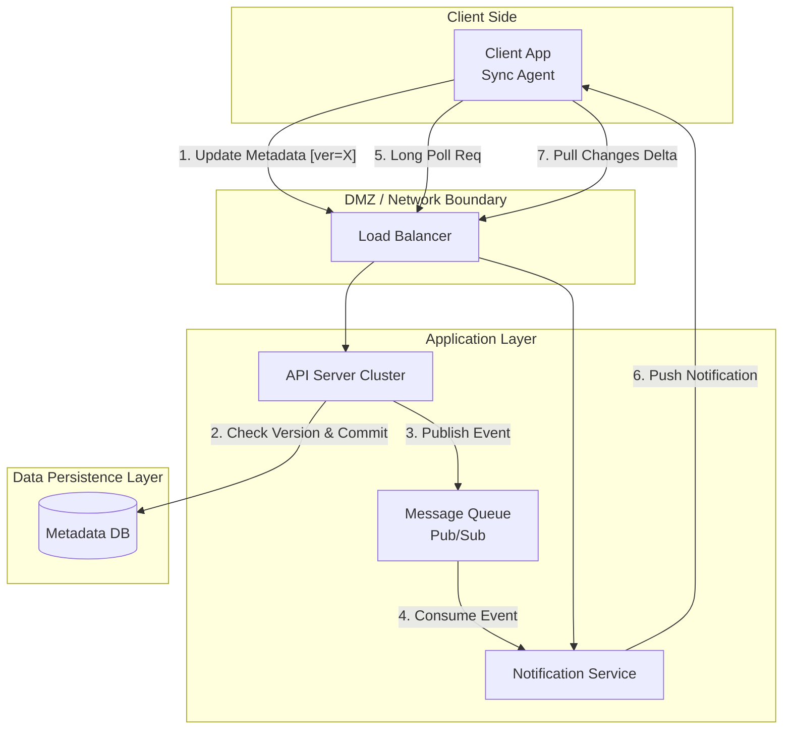

# LLMIteration-2.md

## Step 1: Review Iteration Goal and Drivers

**Goal**: Design the mechanisms required to synchronize state across multiple devices efficiently. This iteration focuses on the "Delta Sync" logic, conflict resolution strategies, and the notification system required to trigger client updates.

**Drivers to Address**:

* **User Stories**:
    * **US-2.1**: Multi-Device Synchronization. (Priority: **P1**)
        * *Description*: Automatic propagation of file changes across devices.
    * **US-2.2**: Bandwidth Efficient Sync (Delta Sync). (Priority: **P1**)
        * *Description*: Only modified blocks of a file should be synced rather than the entire file.
    * **US-2.3**: Conflict Resolution. (Priority: **P1**)
        * *Description*: Handling concurrent edits with a "first wins" strategy.
    * **US-3.3**: Activity Notifications. (Priority: **P1**)
        * *Description*: Alerts for file edits, deletions, or shares to trigger sync.

* **Quality Attribute Scenarios**:
    * **QAS-010**: Delta Synchronization (Bandwidth Optimization). (Priority: **P1**)
        * *Scenario*: Network data transfer volume is proportional to the size of the changes, not total file size.
    * **QAS-012**: Sync Speed / Update Latency. (Priority: **P1**)
        * *Scenario*: Clients reflect changes in near real-time using Long Polling.
    * **QAS-013**: Cache Invalidation on Write. (Priority: **P1**)
        * *Scenario*: System must invalidate caches immediately upon DB write to ensure consistency.
    * **QAS-014**: Concurrent Edit Conflict Resolution. (Priority: **P1**)
        * *Scenario*: Apply "first version wins" strategy; subsequent requests receive a sync conflict error.

* **Constraints**:
    * **C-1 (Communication Protocol)**: The Notification Service must use **Long Polling** (not WebSockets).
    * **C-3 (Consistency)**: Strong Consistency is required.

***

**Architect's Note**:
This iteration shifts focus from the **Data Plane** (Block Servers) to the **Control Plane** (API & Notification Services). We are introducing state management and real-time behavior.

***

## Step 2: Establish Goal for the Iteration by Selecting Drivers

**Iteration Goal**: Design the mechanisms for maintaining **data consistency** and **synchronization** across multiple clients. This involves defining the "Delta Sync" algorithm to optimize bandwidth and the "Notification Service" to ensure near real-time updates.

**Rationale for Driver Selection**:
We are grouping **Synchronization** and **Consistency** because they are two sides of the same coin. You cannot have multi-device sync (US-2.1) without a strategy for handling conflicts (US-2.3) and a trigger mechanism (US-3.3). Addressing these together minimizes the risk of designing a sync protocol that fails under concurrent load.

**Selected Drivers**:

1.  **US-2.1: Multi-Device Synchronization**
    * *Why*: This is the core feature for this iteration. It forces us to define how the server tracks "what client has what version."
2.  **US-2.2: Bandwidth Efficient Sync (Delta Sync)**
    * *Why*: This constrains *how* we sync. We cannot just download the whole file; we need a block-level comparison mechanism.
3.  **US-3.3: Activity Notifications**
    * *Why*: This defines the "trigger." Without it, clients would have to poll blindly, wasting resources.
4.  **QAS-012: Sync Speed / Update Latency**
    * *Why*: This performance requirement forces us to choose efficient communication patterns (Long Polling) over simple periodic polling.
5.  **QAS-014: Concurrent Edit Conflict Resolution**
    * *Why*: This is the primary consistency risk. We must design the database schema and logic to detect and handle race conditions explicitly ("first wins").

***

**Architect's Note**:
We are explicitly prioritizing **Consistency** (QAS-014) over "Availability" in the CAP theorem sense for this specific subsystem. If a conflict occurs, we reject the second write rather than allowing divergent branches to persist silently.

***

## Step 3: Choose One or More Elements of the System to Refine

**Elements to Refine**:

1.  **API Server**:
    * **Refinement**: We need to expand the API Server's responsibilities to include **Sync Logic**. It can no longer just "create files"; it must now handle **Version Control**, **Conflict Detection** (comparing client version vs. server version), and **Delta Calculation** (identifying missing blocks).
2.  **Metadata Database**:
    * **Refinement**: The database schema needs to be refined to track **File Versions** and **Block Lists**. To support Delta Sync (US-2.2), we must store the hash of every block for every file version.
3.  **Client Application**:
    * **Refinement**: The client is no longer a dumb terminal. It requires a **Local Database/Cache** to track what files it currently has, so it can calculate deltas and detect when it is out of sync.

**New Elements to Introduce**:

1.  **Notification Service**:
    * **Description**: A dedicated service to manage real-time updates.
    * **Rationale**: As per **US-3.3** and **QAS-012**, we need a way to push updates to clients. Since the API Server is request-response based, we need a separate component to handle long-lived connections (Long Polling).

***

**Architect's Note**:
The introduction of the **Notification Service** is a significant addition. We are choosing to separate it from the API Server to decouple "stateless" REST operations from "stateful" long-polling connections, allowing them to scale differently.

***

## Step 4: Choose One or More Design Concepts That Satisfy the Selected Drivers

We have selected the following design concepts to address the synchronization, consistency, and notification drivers:

### 1. Differential Synchronization (Block-Level Hashing)
* **Description**: We will implement a sync algorithm where the client splits files into blocks, calculates a hash (checksum) for each, and compares this list with the server. Only blocks with new/different hashes are uploaded.
* **Drivers Addressed**:
    * **US-2.2 (Bandwidth Efficient Sync)**: Minimizes data transfer for large files.
    * **QAS-010 (Delta Sync)**: Ensures network usage is proportional to changes, not file size.
* **Rationale**: This is the industry-standard approach (similar to rsync) for cloud storage. The case study explicitly mentions splitting files into blocks with unique hash values to optimize network traffic.

### 2. Long Polling (Notification Strategy)
* **Description**: Clients will maintain an open HTTP request to the Notification Service. The server holds the request open until a relevant event occurs (or timeout), at which point it responds immediately.
* **Drivers Addressed**:
    * **US-3.3 (Activity Notifications)**: Provides near real-time alerts.
    * **QAS-012 (Sync Speed)**: Minimizes the latency between a change happening and other clients knowing about it.
    * **Constraint C-1**: Explicitly required by the architectural constraints.
* **Rationale**: Chosen because notification traffic is uni-directional (server-to-client) and infrequent. Long polling is less resource-intensive on the server side than maintaining persistent WebSocket connections for millions of idle users.

### 3. Optimistic Locking (Version Control)
* **Description**: We will use a `version` column in the Metadata Database. Every update attempts to increment the version (`UPDATE files SET version = v+1 WHERE id = x AND version = v`).
* **Drivers Addressed**:
    * **US-2.3 (Conflict Resolution)**: Enforces the "first version wins" strategy.
    * **QAS-014**: Prevents "lost updates" by ensuring that if the base version has changed since the client read it, the write fails.
* **Rationale**: This enforces **Strong Consistency** without complex locking mechanisms that would hurt performance. It forces the client to resolve the conflict if they are working on stale data.

### 4. Publish-Subscribe Pattern (Internal Eventing)
* **Description**: The API Server will act as a **Publisher** sending events (e.g., "File X modified") to an internal message queue (or direct interface), and the Notification Service will act as a **Subscriber** to route these events to the correct connected clients.
* **Drivers Addressed**:
    * **US-3.3 (Activity Notifications)**.
* **Rationale**: Decouples the write operation (API Server) from the notification delivery (Notification Service).

### Discarded Alternatives

| Alternative | Reason for Discarding |
| :--- | :--- |
| **WebSockets** | Explicitly prohibited by **Constraint C-1**. While efficient for bi-directional chat, they are considered unnecessary overhead for this specific "infrequent notification" use case. |
| **Periodic Polling (Short Polling)** | Discarded because it creates a trade-off between latency and server load. To achieve "fast sync speed" (QAS-012), the poll interval would need to be very short, generating massive unnecessary traffic. |
| **Last-Write-Wins (Timestamp based)** | Discarded because it violates **US-2.3 (Conflict Resolution)**. Overwriting data based purely on server arrival time or client timestamp can lead to silent data loss, which is unacceptable for a file storage system. |

***

**Architect's Note**:
The combination of **Block-Level Hashing** and **Optimistic Locking** creates a robust protocol:
1.  Check Version (Is it safe to write?).
2.  Check Hashes (What actually changed?).
3.  Write Data (Block Server).
4.  Commit Metadata (API Server).

***

## Step 5: Instantiate Architectural Elements, Sketch Views, Allocate Responsibilities, and Define Interfaces

We have instantiated the following elements to form the **Component-and-Connector** structure for the synchronization subsystem.

### 1. Instantiated Elements & Responsibilities

| Element | Type | Responsibilities | Design Concept / Driver |
| :--- | :--- | :--- | :--- |
| **Notification Service** | Component | - Manages active **Long Polling** connections. - Maps `user_id` to active connection handles. - Pushes "File Changed" events to relevant clients. | Long Polling / US-3.3 |
| **Message Queue** | Connector | - Decouples the API Server from the Notification Service. - Buffers events during high traffic. | Pub-Sub Pattern / US-3.3 |
| **API Server (Sync Logic)** | Component | - **Conflict Detection**: Checks `db_version` vs `client_version`. - **Delta Calculation**: Compares client block hashes vs server block hashes. - **Event Publishing**: Publishes "Change Events" to the Message Queue on successful writes. | Optimistic Locking / US-2.3, US-2.2 |
| **Metadata DB (Refined)** | Component | - Stores **File Versions** and **Block Hashes**. - Enforces uniqueness on `(file_id, version)`. | US-2.2 (Delta Sync) |
| **Client (Sync Agent)** | Component | - Maintains **Local Database/Cache**. - Calculates file block hashes. - Initiates Long Poll requests. - Resolves conflicts (UI). | US-2.1, US-2.3 |

### 2. Sketch of the Component-and-Connector View (Sync Overlay)

This diagram highlights the "Sync Loop" and the "Notification Path."

### 3. Key Interface Definitions

To support the synchronization drivers, we define these specific interfaces:

**I-04: Long Polling Interface (Notification Service)**

  * **Endpoint**: `GET /api/v1/notifications/poll`
  * **Headers**: `Authorization: Bearer <token>`, `Timeout: 60` (Seconds)
  * **Behavior**: The server holds the connection open until an event occurs or timeout is reached.
  * **Output**: `JSON { event_type: "file_update", file_id: "123", timestamp: 12345678 }`

**I-05: Delta Sync Proposal API (API Server)**

  * **Endpoint**: `POST /api/v1/files/{id}/sync`
  * **Input**: `JSON { current_version: 5, new_block_hashes: ["hashA", "hashB", "hashC"] }`
  * **Behavior**:
    1.  Server checks if `current_version == db_version` (Optimistic Locking).
    2.  If mismatch -\> Return **409 Conflict**.
    3.  If match -\> Server compares `new_block_hashes` against stored hashes.
  * **Output**: `JSON { status: "ok", missing_blocks: ["hashB"] }` (Tells client strictly which blocks to upload).

**I-06: Get Changes API (API Server)**

  * **Endpoint**: `GET /api/v1/changes/list`
  * **Input**: `since_token (cursor)`
  * **Rationale**: Allows the client to ask "What happened since I last checked?" when it comes back online or receives a notification.

***

**Architect's Note**:
We have specifically defined **I-05** to handle the "Bandwidth Efficient Sync" (US-2.2). Instead of uploading the file, the client sends a *list of hashes*. The server responds with only the *missing* hashes. This minimizes bandwidth significantly.

***

## Step 6: Record Design Decisions

We have documented the following design decisions in the Architecture document:

### 1. Synchronization & Consistency Strategies

| Decision | Driver | Rationale | Discarded Alternative |
| :--- | :--- | :--- | :--- |
| **Block-Level Differential Sync** | **US-2.2** (Bandwidth), **QAS-010** | Splitting files into blocks and comparing hashes allows the system to transfer *only* the modified parts. This is critical for mobile users and large files, reducing data transfer by orders of magnitude. | **Whole File Sync**: Discarded as it consumes excessive bandwidth and time for small edits to large files. |
| **Optimistic Locking (Versioning)** | **US-2.3** (Conflict Resolution), **QAS-014** | Using a version number to detect concurrent writes allows us to enforce "First-Write-Wins" without complex database locks. It shifts the resolution responsibility to the client, ensuring no data is silently overwritten (Strong Consistency). | **Last-Write-Wins (LWW)**: Discarded because relying on timestamps can lead to "lost updates" where one user unknowingly overwrites another's work. |
| **Client-Side Delta Calculation** | **US-2.2** | The client is responsible for calculating hashes of its local file and sending the *list of hashes* to the server. This offloads CPU work from the server and prevents sending the actual data until necessary. | **Server-Side Calculation**: Requires the client to upload the full file first to calculate the diff, which defeats the purpose of saving bandwidth. |

### 2. Notification & Connectivity

| Decision | Driver | Rationale | Discarded Alternative |
| :--- | :--- | :--- | :--- |
| **Long Polling** | **Constraint C-1**, **US-3.3** | Explicitly required by the architectural constraints. It provides near real-time updates for uni-directional server-to-client notifications without the complexity of maintaining bi-directional WebSocket state for millions of idle users. | **WebSockets**: Discarded due to Constraint C-1 and the "infrequent" nature of the notifications. **Periodic Polling**: Discarded as it compromises either latency (too slow) or server load (too frequent). |
| **Pub/Sub for Internal Events** | **US-3.3**, **Scalability** | Decouples the **API Server** (Write operations) from the **Notification Service** (Connection holding). This ensures that a slow notification delivery does not block the main file upload/edit transactions. | **Synchronous RPC**: Discarded because the API server should not wait for the Notification Service to confirm delivery before responding to the user. |

### 3. Data Schema Refinement

| Decision | Driver | Rationale | Discarded Alternative |
| :--- | :--- | :--- | :--- |
| **Metadata DB Separation (User/File vs. Block)** | **US-2.2** | To support Delta Sync, the DB must store the *structure* of the file (list of block hashes) separately from the file metadata (name, owner). This allows us to reconstruct any version of a file by referencing immutable blocks. | **Storing Block IDs in File Table**: Discarded as it violates normalization and makes versioning difficult. |

***

**Architect's Note**:
The decision to use **Optimistic Locking** is the "Safety Valve" of the system. It ensures that no matter how complex the sync logic gets, the database will strictly reject any write that isn't based on the latest version, preserving data integrity (QAS-014).

***

## Step 7: Perform Analysis of Current Design and Review Iteration Goal

### 1. Design Analysis

We have reviewed the updated **Component-and-Connector** structure and **Design Decisions** against the drivers selected for this iteration.

| Driver | Status | Analysis |
| :--- | :--- | :--- |
| **US-2.1 (Multi-Device Sync)** | **Addressed** | The **Notification Service** + **Long Polling** ensures that a change on Device A immediately triggers a "Pull" on Device B. The **Sync Agent** on the client side is now responsible for reacting to these triggers. |
| **US-2.2 (Bandwidth Efficient Sync)** | **Addressed** | The **Delta Sync Proposal API (I-05)** allows clients to send *only hashes* first. The server responds with the missing block list. This strictly limits bandwidth usage to actual changes, satisfying the requirement. |
| **US-2.3 / QAS-014 (Conflict Resolution)** | **Addressed** | **Optimistic Locking** (Version Checking) in the API Server ensures that if `client_version != db_version`, the write is rejected (409 Conflict). This enforces the "First-Write-Wins" strategy required by the expert analysis. |
| **US-3.3 / QAS-012 (Notifications & Latency)** | **Addressed** | **Long Polling** satisfies the near real-time requirement (QAS-012) while adhering to Constraint C-1 (No WebSockets). The **Pub/Sub** pattern ensures the write path (API Server) is not slowed down by notification delivery. |

### 2. Iteration Goal Review

  * **Goal**: Design synchronization, consistency, and notification mechanisms.
  * **Outcome**: **Achieved**. We have transformed the system from a simple "File Storage" bucket into a "Synchronized Drive" by adding the Notification Service, Message Queue, and Versioning logic.

### 3. Next Steps

With the functional core (Storage + Sync) complete, we must now address the **non-functional** beast: **Scale**.
**Iteration 3** will focus on **Reliability and Scalability** (Sharding, Replication, Hardware Failure) to ensure the system can actually handle the 10M DAU and 500PB data load.
