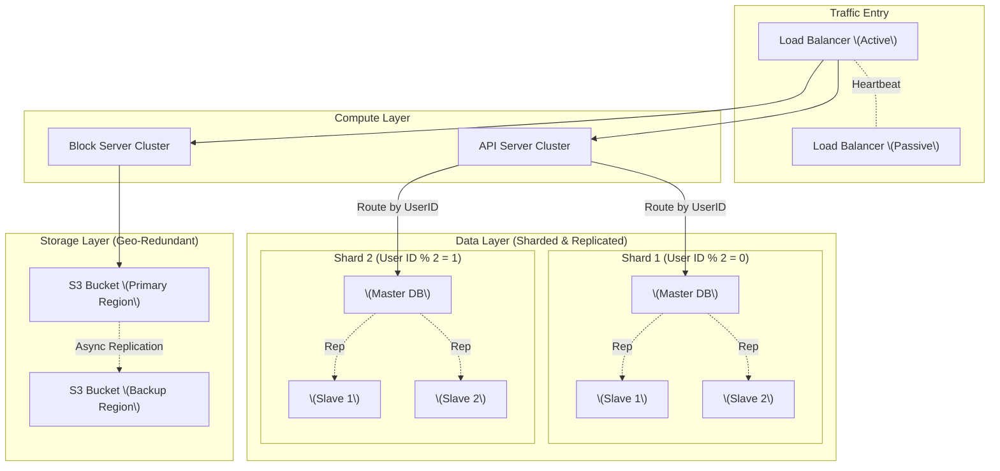
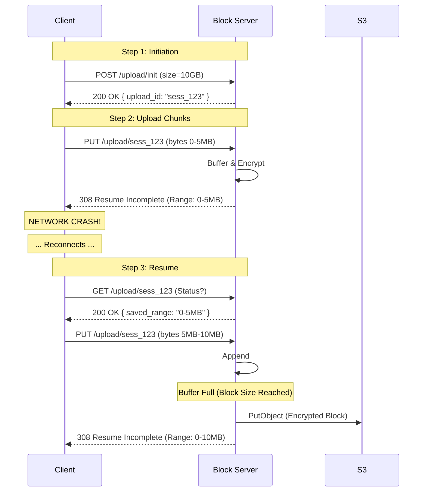

# LLMIteration-3.md

## Step 1: Review Iteration Goal and Drivers

**Goal**: Refine the architecture to support the targeted scale (10M DAU, 500PB Data) and ensure resilience against infrastructure failures. This iteration involves designing the sharding strategy, replication handling, and horizontal scaling mechanisms.

**Drivers to Address**:

* **User Stories**:
    * **US-1.2**: Resumable Upload for Large Files. (Priority: **P1**)
        * *Description*: Handling network interruptions during large file uploads.

* **Quality Attribute Scenarios (Reliability)**:
    * **QAS-001**: Storage Node Hardware Failure. (Priority: **P1**)
        * *Scenario*: Data loss is explicitly "unacceptable".
    * **QAS-002**: Regional Data Center Outage. (Priority: **P1**)
        * *Scenario*: Resilience against major disasters using cross-region replication.
    * **QAS-003**: Network Interruption (Upload). (Priority: **P1**)
        * *Scenario*: Supports US-1.2; essential for 10GB files.

* **Quality Attribute Scenarios (Availability)**:
    * **QAS-004**: Web/API Server Failure. (Priority: **P1**)
        * *Scenario*: System must resist single points of failure.
    * **QAS-005**: Metadata Database Master Failure. (Priority: **P1**)
        * *Scenario*: DB failure stops all operations; requires failover.

* **Quality Attribute Scenarios (Scalability)**:
    * **QAS-006**: High Traffic Surge. (Priority: **P1**)
        * *Scenario*: Handling peak loads (480 QPS) without service denial.
    * **QAS-007**: User Base Growth to 50 Million. (Priority: **P1**)
        * *Scenario*: Architecture must support 50M registered users.
    * **QAS-008**: Massive Data Accumulation (500 PB). (Priority: **P1**)
        * *Scenario*: Database sharding is necessary to support this volume.

***

**Architect's Note**:
This iteration transforms our "Service-Based Architecture" into a true "Distributed System." We will stop treating the Database as a single box and the Storage as a simple bucket.

***

## Step 2: Establish Goal for the Iteration by Selecting Drivers

**Iteration Goal**: Design the **horizontal scaling** strategies (Database Sharding) and **fault tolerance** mechanisms (Replication, Resumable Uploads) required to support 500PB of data and high availability.

**Rationale for Driver Selection**:
We are prioritizing **Scalability** and **Reliability** equally.
1.  **Scalability**: A single relational database instance cannot hold the metadata for 500PB of files. Sharding is mandatory (QAS-008).
2.  **Reliability**: At this scale, hardware failure is not an exception; it is the norm. We must design for failure (QAS-001, QAS-005).

**Selected Drivers**:

1.  **QAS-008: Massive Data Accumulation (500 PB)**
    * *Why*: This is the "System Breaker." Without addressing this, the Metadata DB will choke. It forces the decision to **Shard** the database.
2.  **QAS-005: Metadata Database Master Failure**
    * *Why*: The database is the "Source of Truth." If it goes down, the system stops. We need **Replication** and **Failover** strategies.
3.  **QAS-001: Storage Node Hardware Failure**
    * *Why*: Data loss is unacceptable. We must leverage S3's durability features explicitly.
4.  **US-1.2: Resumable Upload for Large Files**
    * *Why*: Uploading a 10GB file on a shaky network (QAS-003) is impossible without "Resume" capability. This drives the API design for the Block Server.
5.  **QAS-002: Regional Data Center Outage**
    * *Why*: To ensure high availability during disasters, we must utilize **Cross-Region Replication**.

***

**Architect's Note**:
We are explicitly grouping **US-1.2 (Resumable Upload)** with **Reliability**. From an architectural perspective, a "resumable upload" is just a "fault-tolerant write operation."

***

## Step 3: Choose One or More Elements of the System to Refine

**Elements to Refine**:

1.  **Metadata Database**:
    * **Current State**: A single relational database instance.
    * **Refinement Needed**: We must decompose this into a **Sharded Database Cluster**. A single node cannot hold the petabytes of metadata required. We also need to introduce **Replication (Master-Slave)** to handle failover.

2.  **Block Server**:
    * **Current State**: A simple "Upload/Download" streamer.
    * **Refinement Needed**: We need to add state management for **Resumable Uploads**. The server must be able to query "how much of file X has been uploaded?" and accept partial chunks to satisfy **US-1.2**.

3.  **Cloud Storage (S3)**:
    * **Current State**: A logical "Storage Component."
    * **Refinement Needed**: We need to explicitly define **Cross-Region Replication (CRR)** buckets. We will treat storage as a multi-region entity (Primary Region + Backup Region) to satisfy **QAS-002**.

4.  **Load Balancer**:
    * **Current State**: A single entry point.
    * **Refinement Needed**: To avoid a Single Point of Failure (SPOF) as per **QAS-004**, we must refine this into a **High Availability (HA) Pair** with heartbeat monitoring.

***

**Architect's Note**:
The transformation of the **Metadata DB** is the most significant change. We are moving from a "Monolith DB" to a "Sharded Cluster." This will ripple through the API Server, which now needs to know *how* to route queries to the correct shard.

***

## Step 4: Choose One or More Design Concepts That Satisfy the Selected Drivers

We have selected the following design concepts to address the scalability and reliability drivers:

### 1. Database Sharding (Horizontal Partitioning) by `user_id`
* **Description**: We will split the Metadata Database into multiple independent shards. The sharding key will be `user_id` (e.g., `user_id % 4` directs to Shard 1, 2, 3, or 4).
* **Drivers Addressed**:
    * **QAS-008 (Massive Data Accumulation)**: Allows the system to scale storage linearly by adding more shards.
* **Rationale**: The Case Study explicitly identifies **sharding based on user_id** as the solution for the "space full" problem. This ensures that all of a user's data (files, blocks, versions) resides on the same node, optimizing the most common query patterns (e.g., "List all my files") without requiring cross-shard joins.

### 2. Master-Slave Replication (Database High Availability)
* **Description**: Each database shard will have one **Master** node (Read/Write) and multiple **Slave** nodes (Read-Only).
* **Drivers Addressed**:
    * **QAS-005 (DB Master Failure)**: Provides immediate failover capability.
    * **QAS-006 (High Traffic Surge)**: Read operations (file listings) can be offloaded to slave nodes to scale throughput.
* **Rationale**: Allows for **Automatic Failover** (promoting a slave to master) and separates read/write concerns.

### 3. Resumable Upload Protocol (Checkpointing)
* **Description**: We will implement a 3-step upload process:
    1.  **Initiate**: Client requests a "Resumable URL/Session ID".
    2.  **Upload**: Client sends chunks with byte-range headers (`Content-Range: bytes 0-1000/*`).
    3.  **Resume**: If interrupted, client queries "current status" and resumes from the last successful byte offset.
* **Drivers Addressed**:
    * **US-1.2 (Resumable Upload)**.
    * **QAS-003 (Network Interruption)**.
* **Rationale**: This approach transforms a potentially fragile long-running connection into a series of small, robust transactions. The Case Study outlines this specific flow to handle unstable networks.

### 4. Cross-Region Replication (Geo-Redundancy)
* **Description**: We will configure Amazon S3 to automatically replicate data from the primary region (e.g., `us-east-1`) to a secondary region (e.g., `us-west-2`).
* **Drivers Addressed**:
    * **QAS-002 (Regional Outage)**.
    * **QAS-001 (Hardware Failure)**.
* **Rationale**: Leveraging the cloud provider's native replication features (S3 CRR) is more reliable and cost-effective than building a custom replication engine.

### Discarded Alternatives

| Alternative | Reason for Discarding |
| :--- | :--- |
| **Sharding by `file_id`** | Discarded because it scatters a single user's data across multiple shards. Generating a simple "List my files" view would require querying *every* shard and aggregating results, which is a massive performance bottleneck. |
| **Multi-Master Replication** | Discarded due to the complexity of conflict resolution in a "split-brain" scenario. Master-Slave is sufficient for the defined availability requirements and simpler to maintain. |

***

**Architect's Note**:
The choice of **`user_id` sharding** creates a potential "Hot Shard" issue (if one user stores petabytes), but given the constraints (10GB limit per file, 10GB free quota), the data distribution per user is reasonably bounded, making this a safe choice.

***

## Step 5: Instantiate Architectural Elements, Sketch Views, Allocate Responsibilities, and Define Interfaces

We have instantiated the following elements to form the **Distributed Infrastructure** view.

### 1\. Instantiated Elements & Responsibilities

| Element | Type | Responsibilities | Design Concept / Driver |
| :--- | :--- | :--- | :--- |
| **Metadata Shard (1..N)** | Component | - Stores metadata for a subset of users (`user_id % N`).<br>- Handles Write operations (Master). | Sharding / QAS-008 |
| **DB Read Replica** | Component | - Replicates data from the Master Shard.<br>- Handles Read-only queries (File Listing).<br>- Acts as failover target. | Master-Slave / QAS-005 |
| **Load Balancer (HA Pair)** | Component | - Monitors health of API/Block servers.<br>- Redistributes traffic upon server failure.<br>- Fails over to passive LB if active LB dies. | HA / QAS-004 |
| **S3 (Primary Region)** | Component | - Active storage for file blocks.<br>- Auto-replicates to Secondary Region. | QAS-002 |
| **S3 (Secondary Region)** | Component | - Passive backup storage.<br>- Ensures durability against regional disasters. | QAS-002 |
| **Block Server (Stateful)** | Component | - Manages **Resumable Upload Sessions**.<br>- Tracks "bytes received" for incomplete uploads.<br>- Assembles chunks into blocks. | US-1.2 |

### 2\. Sketch of the Component-and-Connector View (Distributed)

This diagram illustrates the **Sharding** and **Replication** topology.



### 3\. Key Interface Definitions

To support **Resumable Uploads (US-1.2)**, we refine the Block Server interface to follow the 3-step protocol described in the case study:

**I-07: Resumable Upload Initiation**

  * **Endpoint**: `POST /api/v1/files/upload?uploadType=resumable`
  * **Input**: `JSON { name: "video.mp4", size: 10GB }`
  * **Output**: `200 OK { upload_url: "https://api.drive.com/upload/session_123" }`
  * **Rationale**: Creates a session to track the upload state.

**I-08: Chunk Upload (Resumable)**

  * **Endpoint**: `PUT /upload/session_123`
  * **Headers**: `Content-Range: bytes 0-5242879/10737418240`
  * **Body**: Binary Chunk (5MB)
  * **Behavior**: Server appends bytes to the temp file.
  * **Output**: `308 Resume Incomplete { Range: "0-5242879" }` or `200 OK` (if finished).

**I-09: Upload Status Query**

  * **Endpoint**: `GET /upload/session_123`
  * **Function**: Used after a network crash to ask "Where should I resume from?"
  * **Output**: `200 OK { size: 5242880 }` (Client resumes from byte 5242880).

***

**Architect's Note**:
The **API Server** now implicitly takes on the role of a "Router." It must calculate `hash(user_id) % N` to know which Database connection string to use. This adds complexity to the API layer but keeps the database layer "shared-nothing" and infinitely scalable.

***

## Step 6: Record Design Decisions

We have documented the following design decisions in the Architecture document:

### 1. Scalability Strategies (Database)

| Decision | Driver | Rationale | Discarded Alternative |
| :--- | :--- | :--- | :--- |
| **Sharding by `user_id`** | **QAS-008** (500PB Data), **QAS-007** (Scale) | Splitting the database based on `user_id` ensures that all metadata for a specific user resides on the same shard. This allows "List my files" queries to be executed against a single node, avoiding expensive cross-shard joins (scatter-gather). | **Sharding by `file_id`**: Discarded because listing a user's files would require querying every shard, causing massive performance degradation. |
| **Master-Slave Replication** | **QAS-005** (DB Failure), **QAS-006** (Read Load) | Provides high availability (automatic failover) and allows read-heavy traffic (file listings) to be offloaded to slave nodes, increasing total throughput. | **Multi-Master Replication**: Discarded due to the complexity of conflict resolution (Split-brain) and the requirement for Strong Consistency. |

### 2. Reliability & Fault Tolerance

| Decision | Driver | Rationale | Discarded Alternative |
| :--- | :--- | :--- | :--- |
| **Resumable Upload Protocol (3-Step)** | **US-1.2** (Resumable), **QAS-003** (Net Interrupt) | Breaking large uploads (10GB) into chunks and tracking state allows the system to resume from the last successful byte after a failure, rather than restarting from zero. | **Single Stream Upload**: Discarded as it is too fragile for large files on unstable mobile networks. |
| **S3 Cross-Region Replication (CRR)** | **QAS-002** (Region Outage), **QAS-001** (Data Loss) | Leveraging the cloud provider's native infrastructure for geo-redundancy ensures data survives the total loss of a data center without custom implementation effort. | **Custom Sync to Backup DC**: Discarded as "Reinventing the wheel"; S3 CRR is industry standard and cost-effective. |
| **Active-Passive Load Balancers** | **QAS-004** (API Failure) | Ensures that the entry point to the system is not a Single Point of Failure (SPOF). Heartbeat monitoring ensures rapid failover. | **Single Load Balancer**: Discarded as it violates the high availability requirement. |

***

**Architect's Note**:
The decision to shard by `user_id` implies that we must implement routing logic in the API Server (or a smart middleware) to determine which shard connection to use for a given request. This increases code complexity but is the only viable way to reach the 500PB scale.

***

## Step 7: Perform Analysis of Current Design and Review Iteration Goal

### 1\. Design Analysis

We have reviewed the **Distributed Infrastructure** view and **Design Decisions** against the drivers selected for this iteration.

| Driver | Status | Analysis |
| :--- | :--- | :--- |
| **QAS-008 (500 PB Data)** | **Addressed** | **Database Sharding by `user_id`** allows the Metadata DB to scale horizontally. By adding more shards, we increase storage capacity linearly to meet the 500 PB requirement. |
| **QAS-005 (DB Master Failure)** | **Addressed** | **Master-Slave Replication** ensures that if a Master shard fails, a Slave can be promoted to maintain availability. This removes the single point of failure in the database layer. |
| **QAS-001 / QAS-002 (Disaster Recovery)** | **Addressed** | **S3 Cross-Region Replication (CRR)** ensures that data is durable even if an entire AWS region goes offline. The architecture explicitly acknowledges primary and secondary storage regions. |
| **US-1.2 (Resumable Upload)** | **Addressed** | The **Block Server** has been refined to be "session-aware" for uploads. The **3-Step Protocol (Initiate, Upload Chunk, Resume)** allows clients to recover from network failures (QAS-003) without restarting. |
| **QAS-004 (API Availability)** | **Addressed** | The **Active-Passive Load Balancer** configuration ensures the entry point remains available even if hardware fails. |

### 2\. Iteration Goal Review

  * **Goal**: Design horizontal scaling and fault tolerance mechanisms.
  * **Outcome**: **Achieved**. The architecture is no longer a "single server" concept. It is now a fully distributed system capable of handling the defined scale constraints.

### 3\. Next Steps

The system is now **Secure** (Iter 1), **Synchronized** (Iter 2), and **Scalable** (Iter 3).
The final step is **Iteration 4**, where we will address the remaining **Optimization** (Compression) and **Security** (Sharing/ACLs) requirements to complete the design.


-----

# LLMArchitecture-3.md

# Google Drive System - Architecture Document

## Table of Contents

1.  [Introduction](https://www.google.com/search?q=%231-introduction)
2.  [Context Diagram](https://www.google.com/search?q=%232-context-diagram)
3.  [Architectural Drivers](https://www.google.com/search?q=%233-architectural-drivers)
4.  [Views of the module viewtype](https://www.google.com/search?q=%234-views-of-the-module-viewtype)
5.  [Views of the component-and-connector viewtype](https://www.google.com/search?q=%235-views-of-the-component-and-connector-viewtype)
6.  [Views of the allocation viewtype](https://www.google.com/search?q=%236-views-of-the-allocation-viewtype)
7.  [Sequence Diagrams](https://www.google.com/search?q=%237-sequence-diagrams)
8.  [Interfaces](https://www.google.com/search?q=%238-interfaces)
9.  [Design Decisions](https://www.google.com/search?q=%239-design-decisions)

## 1\. Introduction

This document defines the software architecture for the Google Drive-like system. This version includes the core storage logic, synchronization subsystems, and the **Distributed Infrastructure** required to support 10M DAU and 500PB of data.

## 2\. Context Diagram

*(See LLMArchitecture-1.md - No changes in Iteration 3)*

## 3\. Architectural Drivers

**Key Priorities for Current Architecture:**

  * **US-1.1**: Simple File Upload (P1)
  * **US-1.2**: Resumable Upload (P1)
  * **US-2.2**: Delta Sync (P1)
  * **QAS-008**: Massive Data Accumulation / Sharding (P1)
  * **QAS-005**: DB Master Failure / Replication (P1)
  * **QAS-002**: Regional Outage / CRR (P1)

## 4\. Views of the module viewtype

*(Section currently empty)*

## 5\. Views of the component-and-connector viewtype

### 5.1 Distributed System Topology

This view illustrates the **Sharding** and **Replication** strategy. It shows how the monolithic "Metadata DB" and "S3" from previous iterations are actually deployed as clusters to ensure scale and reliability.

[Image of distributed system architecture]

```mermaid
graph TD
    subgraph "Traffic Entry"
        LB_A[Load Balancer (Active)]
        LB_P[Load Balancer (Passive)]
        LB_A -. Heartbeat .- LB_P
    end

    subgraph "Compute Layer"
        API[API Server Cluster<br>(Stateless)]
        Block[Block Server Cluster<br>(Stateful Uploads)]
        Notif[Notification Service]
    end

    subgraph "Data Layer (Sharded & Replicated)"
        subgraph "Shard 1 (User ID % N = 0)"
            M1[(Master DB)]
            S1_1[(Slave 1)]
            M1 -. Sync .-> S1_1
        end
        
        subgraph "Shard N (User ID % N = X)"
            MN[(Master DB)]
            SN_1[(Slave 1)]
            MN -. Sync .-> SN_1
        end
    end
    
    subgraph "Storage Layer (Geo-Redundant)"
        S3_Pri[S3 Bucket (Primary Region)]
        S3_Sec[S3 Bucket (Backup Region)]
        S3_Pri -. Async CRR .-> S3_Sec
    end

    LB_A --> API
    LB_A --> Block
    LB_A --> Notif
    
    API -- "Route by UserID" --> M1
    API -- "Route by UserID" --> MN
    
    Block --> S3_Pri
```

#### Component Responsibilities (Updated)

| Component | Responsibilities |
| :--- | :--- |
| **Load Balancer (HA)** | Entry point; SSL Termination; **Health Monitoring**; **Failover**. |
| **API Server** | **Sharding Router** (Determines which DB Shard to query based on UserID); Sync Logic. |
| **Block Server** | **Resumable Session Manager**; Encrypts/Decrypts; Uploads to S3. |
| **DB Shards (1..N)** | Stores metadata for a specific subset of users; supports linear scaling. |
| **DB Slaves** | Read-only replicas for high availability and offloading read traffic. |
| **S3 (Primary/Secondary)** | Physically stores encrypted blocks; replicates data across regions for disaster recovery. |

## 6\. Views of the allocation viewtype

*(Section currently empty)*

## 7\. Sequence Diagrams

### 7.1 Iteration 3 Drivers (Reliability)

#### US-1.2: Resumable Upload (3-Step Protocol)

This sequence shows how the system handles a network interruption.



## 8\. Interfaces

### 8.1 Resumable Upload Interfaces

#### I-07: Resumable Init API

  * **Endpoint**: `POST /files/upload?resumable=true`
  * **Output**: `upload_id`

#### I-08: Chunk Upload API

  * **Endpoint**: `PUT /upload/{upload_id}`
  * **Header**: `Content-Range: bytes start-end/total`
  * **Response**: `308 Resume Incomplete` (standard protocol)

## 9\. Design Decisions

### 9.1 Iteration 3 Decisions (Scale & Reliability)

| Driver | Decision | Rationale | Discarded Alternative |
| :--- | :--- | :--- | :--- |
| **QAS-008** | **Sharding by `user_id`** | Keeps all user metadata on one node, optimizing common queries ("List my files"). Scaling is linear by adding shards. | **Sharding by `file_id`**: Causes massive "scatter-gather" query overhead for file listings. |
| **QAS-005** | **Master-Slave Replication** | Ensures DB availability during Master failure and scales read throughput for high traffic. | **Multi-Master**: Too complex for consistency requirements. |
| **US-1.2** | **Resumable Uploads** | 3-step protocol (Init, Upload, Query) allows recovering large transfers on unstable networks. | **Stream Upload**: Fails completely on net drop. |
| **QAS-002** | **S3 Cross-Region Replication** | Uses native cloud capabilities to protect against regional disasters. | **Custom Backup**: High maintenance/cost. |

-----

We have completed **Iteration 3**. The system is now designed for **Scale** and **Reliability**.

Would you like me to proceed to **Iteration 4**, where we will address the final layer: **Security (Sharing/ACLs) and Optimization (Compression)**?