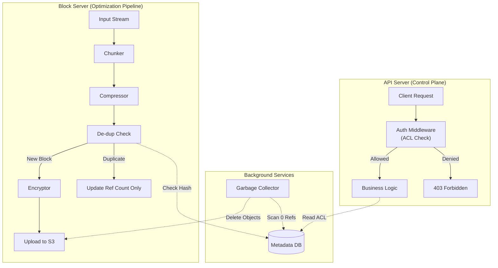

# LLMIteration-4.md

## Step 1: Review Iteration Goal and Drivers

**Goal**: Address the remaining collaboration features and finalize security boundaries. This iteration also implements "Desirable" (P2/P3) features such as version history and storage optimizations (compression, de-duplication) that were not blocking the core architecture.

**Drivers to Address**:

* **User Stories**:
    * **US-3.1**: File Revision History. (Priority: **P2**)
        * *Description*: Viewing and restoring previous file versions.
    * **US-3.2**: File Sharing. (Priority: **P2**)
        * *Description*: Sharing files with specific users and enforcing permissions.

* **Quality Attribute Scenarios (Security)**:
    * **QAS-018**: Unauthorized Access Control. (Priority: **P1**)
        * *Scenario*: Users must only access their own or shared files; system denies unauthorized requests.

* **Quality Attribute Scenarios (Performance/Optimization)**:
    * **QAS-011**: Data Compression. (Priority: **P2**)
        * *Scenario*: Applying compression to blocks to reduce storage cost and transfer time.
    * **QAS-015**: ACID Transaction Integrity. (Priority: **P1**)
        * *Scenario*: Complex metadata updates (sharing, versioning) must be atomic.

***

**Architect's Note**:
Although **US-3.2 (Sharing)** is listed as P2, it introduces **QAS-018 (Access Control)** which is P1. We cannot implement sharing without a robust Access Control List (ACL) mechanism. This is the primary complexity of this iteration.

***

## Step 2: Establish Goal for the Iteration by Selecting Drivers

**Iteration Goal**: Design the **Access Control (ACL)** mechanisms required to support secure file sharing and implement **Storage Optimizations** (Compression, De-duplication) to reduce infrastructure costs and improve transfer speeds.

**Rationale for Driver Selection**:
We are addressing two distinct but critical areas:
1.  **Collaboration**: Sharing (US-3.2) is a core feature of the product "Google Drive". It requires breaking the assumption that "User ID = Owner ID."
2.  **Cost & Efficiency**: Storing 500PB of data is expensive. We must implement Compression (QAS-011) and De-duplication to make the business model viable.

**Selected Drivers**:

1.  **US-3.2: File Sharing**
    * *Why*: This forces the introduction of an "Authorization Layer" in the API Server. We need to track who has access to what, beyond simple ownership.
2.  **QAS-018: Unauthorized Access Control**
    * *Why*: P1 Security. With sharing enabled, the risk of data leakage increases. We must strictly enforce permissions (Read vs. Write) at the API level.
3.  **QAS-011: Data Compression**
    * *Why*: P2 Optimization. Reduces bandwidth (upload/download speed) and storage costs. The Case Study explicitly mentions applying compression to blocks.
4.  **US-3.1: File Revision History**
    * *Why*: P2 Feature. Requires a strategy for storing multiple versions without exploding storage usage (e.g., limits or de-duplication).
5.  **QAS-015: ACID Transaction Integrity**
    * *Why*: P1 Consistency. Operations like "Share File" or "Restore Version" involve multiple metadata updates. These must be atomic to prevent corrupted permissions.

***

**Architect's Note**:
The introduction of **US-3.2 (Sharing)** complicates our Sharding strategy (Iteration 3). If User A (Shard 1) shares a file with User B (Shard 2), how does User B see it? We will need to design a "shared_files" mapping that bridges the shards.

***

## Step 3: Choose One or More Elements of the System to Refine

**Elements to Refine**:

1.  **API Server (Authorization & Sharing Logic)**:
    * **Refinement Needed**: We must introduce an **Authorization Middleware** that intercepts every request to check permissions (Owner vs. Editor vs. Viewer) before processing.
    * **New Logic**: "Share File" endpoint logic to update the Access Control List (ACL) in the database.

2.  **Block Server (Optimization Pipeline)**:
    * **Refinement Needed**: We need to inject a **Compression Module** into the upload pipeline. The processing order must be: `Chunk -> Compress -> Encrypt -> Upload`.
    * **Refinement Needed**: We need **De-duplication Logic**. Before uploading a block, the server should check if a block with the same hash already exists to avoid storing duplicates.

3.  **Metadata Database (Schema Updates)**:
    * **Refinement Needed**:
        * **ACL Table**: To store permissions (e.g., `user_id`, `file_id`, `access_level`).
        * **Shared Files Mapping**: To allow a user to see files located on *other* shards (since sharding is by Owner ID).
        * **Version History**: To track the lineage of file versions (`file_version` table).

***

**Architect's Note**:
The **De-duplication** refinement in the Block Server is high-impact. It requires the Block Server to perform a "lookup" (Check existence) before a "write" (Upload). This adds latency but saves massive amounts of storage.

***

## Step 4: Choose One or More Design Concepts That Satisfy the Selected Drivers

We have selected the following design concepts to address the security and optimization drivers:

### 1. Discretionary Access Control (ACL-based Sharing)
* **Description**: We will implement an Access Control List (ACL) model. A `permissions` table will link `file_id`, `user_id`, and `access_level` (read/write).
* **Drivers Addressed**:
    * **US-3.2 (File Sharing)**.
    * **QAS-018 (Unauthorized Access Control)**.
* **Rationale**: This fits the "User-centric" sharing model of Google Drive (User A shares explicitly with User B). It allows fine-grained control per file or folder. The authentication middleware will enforce these checks on every API call.

### 2. Account-Level De-duplication
* **Description**: Before uploading a block, the Block Server checks if a block with the same hash already exists *within that user's namespace*. If it does, we simply reference the existing block ID rather than storing the data again.
* **Drivers Addressed**:
    * **US-3.1 (File Revision History)**: Versions often share 99% of blocks; de-duplication makes storing versions cheap.
    * **Optimization (Cost)**.
* **Rationale**: The Case Study explicitly recommends "Eliminating redundant blocks at the account level". This avoids storage waste without introducing the privacy risks associated with Global De-duplication (where one user could theoretically probe if another user has a specific file).

### 3. Compression-First Pipeline
* **Description**: The Block Server pipeline order will strictly be: **Split -> Compress -> Encrypt -> Store**.
* **Drivers Addressed**:
    * **QAS-011 (Data Compression)**.
* **Rationale**: Encryption generates high-entropy (random-looking) data which cannot be compressed effectively. Compression must happen *before* encryption to yield any storage savings.

### 4. Reference Counting (Garbage Collection)
* **Description**: Since blocks are shared across files (via de-duplication) and versions, we cannot delete a block just because one file is deleted. We will use an asynchronous **Garbage Collector** that scans for blocks with zero references in the metadata table and deletes them from S3.
* **Drivers Addressed**:
    * **US-3.1 (History)** & **De-duplication**.
* **Rationale**: Essential for managing the lifecycle of de-duplicated data. Immediate deletion is unsafe in a system where blocks are immutable and shared.

### Discarded Alternatives

| Alternative | Reason for Discarding |
| :--- | :--- |
| **Global De-duplication** | Discarded due to **Privacy Risks**. Global de-duplication (storing one copy of a popular movie for *all* users) allows side-channel attacks (checking if a hash exists reveals if another user stored it). We adhere to the "Account Level" constraint. |
| **Role-Based Access Control (RBAC)** | Discarded as too rigid for a consumer application. RBAC is better for enterprises (roles like "HR Manager"), but Google Drive users need to share directly with individuals ("Bob"), which fits the ACL model better. |

***

**Architect's Note**:
The decision to use **Account-Level De-duplication** is safer for privacy but less efficient than Global De-duplication. However, for a "Personal Cloud" product, privacy is paramount.

***

## Step 5: Instantiate Architectural Elements, Sketch Views, Allocate Responsibilities, and Define Interfaces

We have instantiated the following elements to form the **Collaboration & Optimization** view.

### 1. Instantiated Elements & Responsibilities

| Element | Type | Responsibilities | Design Concept / Driver |
| :--- | :--- | :--- | :--- |
| **Auth Middleware** | Component (Module) | - Intercepts all API requests. - Queries ACL table to validate `(user_id, file_id, action)`. - Returns 403 Forbidden if denied. | ACL / QAS-018 |
| **Compression Engine** | Component (Module) | - Compresses raw file chunks (e.g., zstd/gzip) before encryption. - Decompresses chunks on download. | Compression / QAS-011 |
| **De-dup Engine** | Component (Module) | - Calculates block hashes. - Checks Metadata DB for existing hash (within account). - Skips upload if hash exists. | Account-Level De-dup / US-3.1 |
| **Garbage Collector** | Component | - Runs asynchronously (Cron/Batch). - Scans for blocks with `ref_count = 0`. - Deletes orphaned blocks from S3. | Reference Counting |
| **Metadata DB (ACL)** | Component | - Stores `access_control` table. - Stores `file_versions` table. - Maps `block_hash` to `storage_path`. | US-3.2, US-3.1 |

### 2. Sketch of the Component-and-Connector View (Logic Flow)

This diagram illustrates the **Upload Pipeline** (Optimization) and the **Access Control** flow.

### 3. Key Interface Definitions

To support **Sharing (US-3.2)** and **Versioning (US-3.1)**, we define the following interfaces:

**I-10: File Sharing API**

  * **Endpoint**: `POST /api/v1/files/{id}/share`
  * **Input**: `JSON { target_email: "bob@example.com", role: "EDITOR" }`
  * **Behavior**: Adds a row to the `permissions` table.
  * **Output**: `200 OK`

**I-11: List Versions API**

  * **Endpoint**: `GET /api/v1/files/{id}/versions`
  * **Output**: `JSON { versions: [{ ver: 1, date: "...", size: "..." }, { ver: 2, ... }] }`

**I-12: Restore Version API**

  * **Endpoint**: `POST /api/v1/files/{id}/restore`
  * **Input**: `JSON { version: 1 }`
  * **Behavior**: Updates the `current_version` pointer in the file metadata. Does *not* duplicate data blocks (uses references).

***

**Architect's Note**:
The **Garbage Collector** is critical here. Without it, if a user deletes a file that shared blocks with other files (or versions), we might accidentally delete data that is still in use (if we were aggressive) or leave "zombie" data forever (if we were passive). The Reference Counting strategy requires this cleanup process.

***

## Step 6: Record Design Decisions

We have documented the following design decisions in the Architecture document:

### 1. Security & Collaboration Decisions

| Decision | Driver | Rationale | Discarded Alternative |
| :--- | :--- | :--- | :--- |
| **Discretionary Access Control (ACL)** | **US-3.2** (Sharing), **QAS-018** (Access Control) | We will use an explicit Access Control List (ACL) table linking Users to Files with specific permissions (Read/Write). This supports the ad-hoc sharing model required by consumer file storage (e.g., "Share this specific file with Bob"). | **Role-Based Access Control (RBAC)**: Discarded as it is designed for organizational structures (e.g., "Managers group"), not individual sharing scenarios. |
| **Auth Middleware Interception** | **QAS-018** | Moving permission checks to a centralized middleware layer ensures that *no* business logic is executed before a valid permission is confirmed. This prevents "IDOR" (Insecure Direct Object Reference) vulnerabilities. | **Check inside Controller**: Discarded as error-prone; developers might forget the check in new endpoints. |

### 2. Storage Optimization Decisions

| Decision | Driver | Rationale | Discarded Alternative |
| :--- | :--- | :--- | :--- |
| **Account-Level De-duplication** | **US-3.1** (Versions), **Optimization** | We will only de-duplicate blocks *within* a specific user's account. This eliminates redundancy from multiple versions or copies of the same file owned by the same user. | **Global De-duplication**: Discarded due to privacy risks (Side-channel attacks). If we de-dup globally, User A could verify if User B possesses a specific file by checking upload timing/hash existence. |
| **Compression-First Pipeline** | **QAS-011** (Compression) | Compression must occur *before* encryption. Encryption algorithms produce high-entropy data (indistinguishable from random noise), which renders compression algorithms ineffective. | **Encrypt-then-Compress**: Discarded as it provides near-zero storage savings. |
| **Reference Counting & Garbage Collection** | **US-3.1**, **De-dup** | Because blocks are shared across file versions, we cannot delete them synchronously when a file is deleted. We must use a background GC process to remove blocks only when their reference count reaches zero. | **Synchronous Deletion**: Discarded as it would corrupt other file versions that reference the same blocks. |

***

**Architect's Note**:
The decision to reject **Global De-duplication** means we will store 10,000 copies of the same popular viral video if 10,000 users upload it. We accept this storage cost to guarantee User Privacy. This is a standard trade-off in personal cloud storage versus public file hosting.

***

## Step 7: Perform Analysis of Current Design and Review Iteration Goal

### 1\. Design Analysis

We have reviewed the **Collaboration & Optimization** view and **Design Decisions** against the drivers selected for this iteration.

| Driver | Status | Analysis |
| :--- | :--- | :--- |
| **US-3.2 (File Sharing)** | **Addressed** | The **Access Control List (ACL)** table and **Auth Middleware** successfully decouple "Ownership" from "Access." The system can now support many-to-many sharing relationships. |
| **QAS-018 (Unauthorized Access)** | **Addressed** | The **Auth Middleware** provides a centralized security gate. By intercepting requests *before* business logic, we ensure that no data is returned to an unprivileged user. |
| **QAS-011 (Compression)** | **Addressed** | The **Compression-First Pipeline** (Compress -\> Encrypt) in the Block Server ensures we maximize storage efficiency before obscuring patterns with encryption. |
| **US-3.1 (Revision History)** | **Addressed** | The **File Versioning** schema allows tracking history. Combined with **Account-Level De-duplication**, storing multiple versions is cost-effective because unchanged blocks are not duplicated physically. |
| **QAS-015 (ACID Integrity)** | **Addressed** | Complex operations like "Restoring a Version" (which updates pointers, references, and metadata) are handled within the **Relational Database** using transactions, ensuring metadata consistency. |

### 2\. Iteration Goal Review

  * **Goal**: Implement collaboration features and storage optimizations.
  * **Outcome**: **Achieved**. The system now supports Sharing, Versioning, Compression, and De-duplication.

### 3\. Final Architecture Assessment

We have completed all planned iterations:

1.  **Core**: Secure Upload/Download (Done).
2.  **Sync**: Delta Sync & Notifications (Done).
3.  **Scale**: Sharding & Replication (Done).
4.  **Optimize**: Sharing & Compression (Done).
