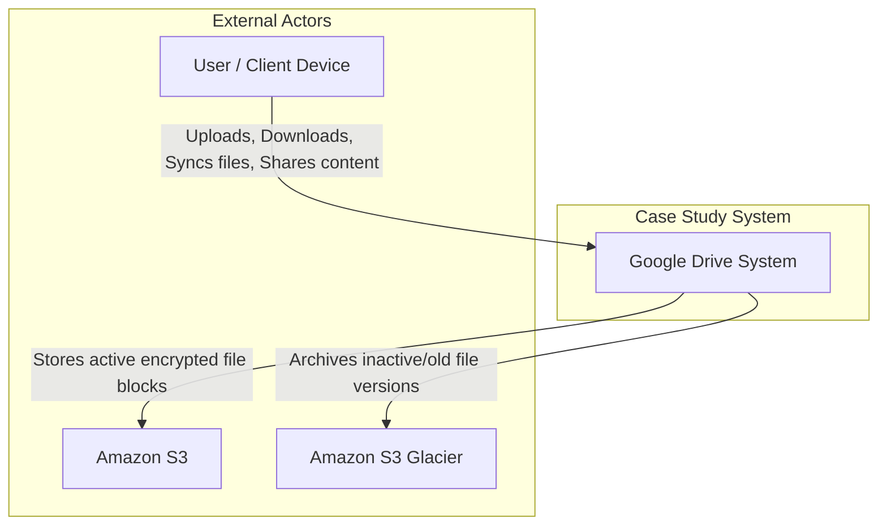

-----

# LLMSystemContext.md

# System Context

### External Actors

| Actor | Description |
| :--- | :--- |
| **User / Client Device** | Represents the human actors defined in the User Stories (Content Creator, Team Lead, Collaborator, etc.) interacting via Web or Mobile applications. They are responsible for initiating file uploads, handling sync conflicts, and managing file permissions. |
| **Amazon S3** | An external object storage service used to store the actual data blocks of active files. It is responsible for providing industry-leading scalability, data availability, and performing same-region and cross-region replication to ensure durability. |
| **Amazon S3 Glacier** | An external cold storage service used for long-term archiving. It is responsible for storing infrequent data, such as old file versions that have not been accessed for months or years, to optimize storage costs. |

-----